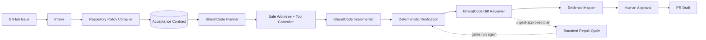

# MergeSutra

### Issue in. Evidence-backed PR out.

MergeSutra is a **BharatCode-powered CLI agent** that turns a GitHub issue into
an evidence-backed pull-request draft — and maps **every acceptance criterion to
the evidence for it**, naming what passed, what failed, and what no gate in the
run could check.

A normal coding agent says *"I fixed the issue."*
MergeSutra says *"Here are the requirements, here is the patch, here is what
ran, here is what passed, here is what failed or could not be checked, here is
the evidence connecting each requirement to the change — you decide whether it
becomes a PR."*

---

> **Honest status: Stage 11 — a run can be verified, written down, read a second
> time by a model that changes nothing, repaired under a yes bound to one plan's
> digest, assembled into the page a person approves as a pull request, and — when
> it stops anywhere along that road — observed for what is true now and continued
> one honest step at a time.**
> What you can run today is `mergesutra doctor`, `mergesutra issue <url>`,
> `mergesutra inspect <dir>`, `mergesutra contract [run-id]`,
> `mergesutra plan [run-id]`, `mergesutra implement [run-id]`,
> `mergesutra verify [run-id]`, `mergesutra report [run-id]`,
> `mergesutra review [run-id]`,
> `mergesutra repair [run-id]`,
> `mergesutra pr [run-id]`,
> `mergesutra status [run-id]` and
> `mergesutra resume [run-id]`: intake
> reads a GitHub issue and pins the exact repository and base commit into a
> versioned run record, `inspect` compiles what a repository itself requires
> into a provenanced contract, `contract` turns those facts into the criteria a
> run must prove, `plan` asks BharatCode how to satisfy them, `implement`
> runs the first bounded loop — BharatCode proposes one action at a time,
> MergeSutra validates it, decides whether it is allowed, and executes the
> allowed ones inside a Git worktree at the pinned base commit. Files really
> change there; **they are not verified by that stage**, so every criterion is
> still `PENDING` and a run that ends well exits `3`, not `0`, because the model
> declaring itself finished is a claim Stage 7 has to check. `verify` runs that
> check: the repository's own gates, only the ones a human names by id, each
> judged by its exit code, with one receipt per gate bound to the patch identity
> it measured. `report` renders those receipts into an evidence pack, and
> `review` asks a second model about exactly those bytes — it files findings it
> can cite, routes them, freezes a repair plan before any edit, and returns with
> the workspace byte-identical. `repair` is the stage that carries a frozen plan
> out, and until `pr` it was the only shipped command that acts on the strength
> of a human decision: nothing runs until you type `--approve-plan <digest>`, the
> digest of the plan you read, there is no `--yes` and no `--force`, and reading a
> plan asks for no credential at all. The cycle then runs through `implement`'s
> own bounded loop under a brief narrowed to the plan's files, and because the
> bytes moved, `verify`'s gates run again over them and `report`'s pack is
> regenerated — a repair never gets to certify itself. `pr` is the last command,
> and the first whose subject is a person rather than a measurement: it assembles
> a pull-request title and body out of what those stages already recorded — no
> model is asked anything, no gate is re-run, no earlier verdict is re-read —
> prints the page in full, and takes one thing as a yes: that page's 64-hex
> digest, typed back after being read. The approval is filed in the run record,
> and filing it is the end of what this build can do with it.
>
> **Shipped end to end:** intake, policy, contract, plan, implement, verify,
> evidence pack, independent review, digest-approved repair, pack rebuild,
> **the PR candidate with a local human approval**, and — for a run that stops
> partway — **`status`, which reads what is true, and `resume`, which continues it
> one stage at a time without holding any approval of its own.**
>
> **Not yet live-published:** a real `git push` and a real GitHub pull request.
> No command of MergeSutra's commits, pushes, comments or opens a PR; the only
> publication transport this build defines throws when called and has no
> production importer, and no output shape has a pull-request address to print.
> So `HUMAN_APPROVED_FOR_PR` — the strongest word
> Stage 10 has — means one person approved one page by digest, and does not mean
> the code is good, that no defect remains, or that anything was accepted.
> `CONTRIBUTION_READY` is still handed out by no stage, and `pr`'s result types
> `published` as the literal `false` on the screen where the news is good.
> **Nothing is published.** The BharatCode adapter,
> configuration, central secret
> redaction, structured errors, tests and CI are **implemented and green**. The
> full `issue → PR` workflow is **under construction**: `mergesutra run` is still
> a planned stub that exits `2`, `status` reads a run and changes nothing, and
> `resume` continues one only when a person types `--execute` — it holds no
> consent, no approval and no remote permission of its own. A publication
> transport and security
> hardening are the next
> stages; see
> [Roadmap](docs/ROADMAP.md). Where this README shows the finished experience,
> it is labelled **target**. What you can run today is shown under
> [Try it now](#try-it-now).

---

## Why MergeSutra

Reading an issue, using a worktree, running tests, or opening a PR are no
longer rare. The scarce thing is **trustworthy evidence** that a patch actually
satisfies what the issue asked and broke nothing else. MergeSutra makes the
evidence chain the product:

- **Acceptance Contract** — the issue + repository policy become a structured,
  versioned contract with stable criterion IDs.
- **Criterion → change → verification → evidence** — traceable, not prose.
- **Truthful gates** — `PASS` only if something really ran and succeeded;
  otherwise `FAIL` / `SKIPPED` / `NOT_AVAILABLE` / `BLOCKED` / `INCONCLUSIVE`.
- **Safety harness above the model** — confined writes, a risk-classified tool
  policy, central redaction, a worktree per run (isolation for clarity, **not a
  sandbox**), and **human approval before any remote action**.
  `mergesutra implement` is the loop that uses them: the
  model picks one action per turn from a closed list, and MergeSutra decides
  whether it runs at all. `mergesutra verify` then judges the result by exit
  codes, and `mergesutra review` reads those same bytes a second time — neither
  decides anything a receipt did not. `mergesutra repair` is the one command that
  changes bytes on a person's word, and the word is a digest, the loop is the
  bounded one above, and the gates run again afterwards.

## How it differs from a normal coding agent

| Normal coding agent            | MergeSutra                                      |
| ------------------------------ | ----------------------------------------------- |
| Issue in → code out            | Issue in → **contract** → patch → **evidence**  |
| "Trust me, tests pass"         | Shows which command ran, exit code, and the test |
| General-purpose                | Owns one workflow: issue → evidence-backed PR   |
| Model output treated as truth  | Model output is untrusted, schema-validated data |
| Repo text is instructions      | Repo text is data, never authority              |

Full positioning and competitor notes: [docs/COMPETITIVE_ANALYSIS.md](docs/COMPETITIVE_ANALYSIS.md),
[docs/ACCEPTANCE_CONTRACT.md](docs/ACCEPTANCE_CONTRACT.md).

## 60-second demo *(target experience — not yet runnable)*

*(Steps 6 and 7 of that list are real today as `mergesutra verify`, step 8's
packaging is real as `mergesutra report`, and the second pair of eyes the roadmap
puts between them is real as `mergesutra review`; step 9's repair is real as
`mergesutra repair`, under a digest-bound yes. The captures below in "Stage 7:
the same run, verified", "Stage 8: the same run, written down", "Stage 9: the
same patch, read a second time" and "Stage 9R: the same plan, carried out and
measured again" are their output. Step 10's approval is real too, as
`mergesutra pr`, and the capture under "Stage 10" is its output — what that
command approves is a page, never a publication. The one-shot `issue` driver that
runs all eight steps unattended is not, and neither is the PR at the end of the
list, which is why this section is a target and the sections after it
are output. The `CONTRIBUTION_READY` line below is part of that mock of a later
build: no stage of this product emits that word.)*

```text
$ mergesutra issue https://github.com/example/project/issues/123

MergeSutra — Issue in. Evidence-backed PR out.
Repository  example/project
Issue       #123 Reject empty date input

[1/8] Repository discovery      PASS
[2/8] Policy discovery          PASS
[3/8] Acceptance Contract       4 criteria
[4/8] Implementation plan       READY
[5/8] Isolated patch            COMPLETE
[6/8] Repository verification   PASS
[7/8] Evidence mapping          4/4 VERIFIED
[8/8] Human approval            WAITING

Verification
PASS unit tests   418 passed
PASS typecheck    PASS lint    PASS build
PASS secret scan  PASS scope guard

Acceptance Contract
AC-1 PASS  Empty input rejected.   Evidence: parser.test.ts…
AC-2 PASS  Valid ISO input unchanged. Evidence: existing date suite…
AC-3 PASS  Error contract preserved. Evidence: …
AC-4 PASS  No unrelated files changed. Evidence: diff scope analysis

Final state: CONTRIBUTION_READY   →  mergesutra report   |   mergesutra pr
```

## Try it now

```bash
# Node >= 22
npm ci
npm run build

# These work today:
node dist/index.js --version
node dist/index.js --help
node dist/index.js doctor            # add --connect to probe BharatCode
node dist/index.js issue https://github.com/owner/repo/issues/123
node dist/index.js issue --repo /path/to/an/existing/clone
node dist/index.js inspect .         # compile a repository's own contract
node dist/index.js inspect /path/to/clone --json
node dist/index.js contract          # turn the newest run into criteria to prove
node dist/index.js contract <run-id> --json
node dist/index.js contract --criterion "Docs say 22 is the floor" --by "Maintainer"
node dist/index.js contract --criterion "Empty input throws" --check "node --test test/invalid.test.mjs" --by "Maintainer"
node dist/index.js plan              # needs BHARATCODE_API_KEY; proposes, runs nothing
node dist/index.js plan <run-id> --json
node dist/index.js implement         # needs a key; writes inside its own worktree only
node dist/index.js implement <run-id> --max-steps 8 --json
node dist/index.js verify            # plans the gates; runs none until you name them
node dist/index.js verify <run-id> --allow VG-001 --allow VG-002
node dist/index.js report            # render the newest run's evidence pack
node dist/index.js report <run-id> --json
node dist/index.js review            # needs a key; asks a second model about this run's patch
node dist/index.js review <run-id> --json
node dist/index.js repair            # shows the newest run's frozen plan; needs no key, edits nothing
node dist/index.js repair <run-id> --approve-plan <64-hex>   # the only command that edits, and only on that word
node dist/index.js pr <run-id>                      # prints the page and the digest that approves it; needs no key
node dist/index.js pr <run-id> --approve <64-hex>   # records that yes locally; opens nothing
node dist/index.js status            # what is true about the newest run, read without changing it
node dist/index.js status <run-id> --json
node dist/index.js resume            # the plan for the newest run and everything it costs; runs nothing
node dist/index.js resume <run-id> --execute                        # the only word that acts
node dist/index.js resume <run-id> --execute --allow VG-001 --allow VG-002
```

An omitted `<run-id>` means the newest run recorded in this directory. When the
directory also holds a newer record this build cannot read, every command above
refuses instead of describing the older run: which record is current is no longer
a question the directory can answer, and a screen that guessed would send a person
to the wrong run's workspace, patch and evidence. The refusal names the file it
could not read and the id it would otherwise have used, and nothing is repaired,
rewritten or quietly skipped.

`pr` closes the chain, and unlike the commands before it it asks a person rather
than a model. It needs a run whose verification, review and evidence pack all
describe the patch currently on disk; if any of them has drifted it names the
stage that owes the update and exits `4` rather than re-running anything to make
its own screen greener. Given a digest typed back against the page it printed, it
files that approval in the run record and still reports `published: false`, no
pull-request address, and no remote touched — because this build has no
publication transport, which is the point of the exercise: approval and
capability are separate facts, and a test suite proves both halves. It needs no
`BHARATCODE_API_KEY`, and it has no exit `0`.

`repair` is the one command here that changes a repository because a person asked
it to, so it has two halves and they need different things. Without
`--approve-plan` it prints the plan `review` froze, the files and gates it names and
the exact line that would authorise it — no credential, no request, no byte moved.
With one it needs `BHARATCODE_API_KEY` (missing is exit `78`, before anything is
edited), runs one bounded cycle through `implement`'s own loop, and sends the bytes it
changed back through `verify`'s gates. It has no exit `0`: `REPAIR_APPLIED` means the
plan ran and the gates ran again, `REPAIR_NEEDS_HUMAN` means a person owes the next
decision, and `REPAIR_BLOCKED` (exit `4`) means nothing moved.

`review` needs a plan, a patch and gate receipts in the run it is pointed at, and
it refuses with exit `78` if `BHARATCODE_API_KEY` is missing — once the run has
proved it is reviewable, before a call is spent, and having created nothing: the
stage reuses the run's own workspace and writes no file except its record. It has
no exit `0`: a second reader that finished its
sentence is not a verdict, so a completed review exits `3` and a review of bytes
that have already moved exits `4`.

`report` needs nothing new: it reads the run record the commands above wrote and
puts `report.md`, `report.json` and `commands.jsonl` beside it. It runs no gate and
decides nothing, and its exit code is the outcome recorded in the run — so
reporting a blocked run exits `4`, not `0`.

`status` is the first command whose subject is the run rather than a stage of it. It
reads the record, asks Git what the workspace looks like, and prints whether each
document on record still describes the bytes that are here now — and it does that
for a run whose workspace is gone as cheerfully as for one that is intact, because
its exit code describes the observation, not the run: `0` for any snapshot it
produced, `1` only when there was nothing to describe. It calls no model, starts no
gate, writes no file, and takes no lock.

`resume` is what a person types after reading it. Without `--execute` it prints a
plan — the one action this run is genuinely owed, the stage and command behind it,
six cost rows, and the digest of the state it was read from — and nothing else; a
preview that spent a model request would not be a preview. With `--execute` it
re-reads that state, refuses if it moved, takes the run's lock, and hands the stage
its own entry point: the same Stage 7 a `mergesutra verify` would run, the same
bounded loop with the same budget already spent. It holds no execution consent, no
repair approval and no publication approval, so a plan that reaches one of those
boundaries stops there and prints whose decision is outstanding — exit `4`, or `3`
where the run is simply waiting for a person. There is no `--yes`, and there is no
`git reset`, `clean`, `checkout -- .` or `stash` anywhere on this path: recovery
means finding out what is true and continuing, never putting the workspace back.

`verify` is the first command that runs a repository's own checks, so it is the
first that asks. Without `--allow` it writes a plan, refuses every repository
gate, prints the exact ids to consent to, and exits `4`. A gate that fails exits
`1`; nothing about that run is softened by the tool.

`implement` is the first command where something changes on disk. It needs a
plan and a contract in the run it is pointed at, and it refuses before it does
any work if `BHARATCODE_API_KEY` is missing — no keyless run, and no worktree
created just to discover that afterwards.

Real `doctor` output (this machine, no secrets shown):

```text
MergeSutra doctor

PASS    Node              v24.21.0
PASS    Git               git version 2.55.0.windows.5
PASS    GitHub CLI        gh version 2.96.0 (2026-07-02)
PASS    GitHub auth       signed in
FAIL    BharatCode key    BHARATCODE_API_KEY is not set.
SKIP    BharatCode reach  pass --connect to test

Not ready. Resolve the FAIL items above.
```

Real `issue` output (this machine, a clone with no `origin` remote and uncommitted
work — so it truthfully reports what it could not establish, and exits `3`; the
workspace path is shortened here, not by MergeSutra). Captured at Stage 4, so its
footer lists the stages that existed then; the same line now reads
`Stages implemented: 0 … 6 (bounded implementation loop)`.

```text
MergeSutra — intake

SKIP          Issue URL           not supplied
PASS          Local repository    C:/Users/…/mergesutra @ 43a9e57274 on main
NOT_AVAILABLE Repository          local clone has no usable origin remote or resolved default branch
NOT_AVAILABLE Base commit         no repository identity established
WARN          Working tree        4 uncommitted change(s); MergeSutra will not read or overwrite them

Issue:        (none supplied)
Repository:   NOT_AVAILABLE
Base commit:  NOT_AVAILABLE
Local clone:  C:/Users/…/mergesutra on main
Outcome:      INCONCLUSIVE

What MergeSutra does not know yet
  No issue text: an issue URL is required before an Acceptance Contract can be derived.
  Fork/archived/private state was not observed (no GitHub query for it).

Run record:   C:\Users\…\mergesutra\.mergesutra\runs\run-20260924T193643Z-5870f1.json
Next stage:   INSPECT — `mergesutra inspect <repo>` compiles the repository contract (Stage 2)

Stages implemented: 0 (foundation), 1 (intake), 2 (repository contract), 3 (acceptance contract), 4 (implementation plan), 5 (safe workspace), 6 (implementation loop), 7 (verification).
No patch, verification, review or pull request was produced by this command.
```

Reading an issue needs the GitHub CLI signed in (`gh auth status`); MergeSutra
never sees or stores a GitHub token, and it never prints the issue body.

Real `inspect` output — the same tool reading its own source repository, which
is why the wording is blunt about what it does not know:

```text
MergeSutra — repository contract

PASS          Repository path     C:\Users\…\mergesutra
PASS          Git metadata        C:/Users/…/mergesutra @ 43a9e57274 on main
PASS          Manifest            node, npm, 12 script(s)
WARN          CI workflows        1 workflow(s), 2 command(s), coverage partial
PASS          Contribution docs   CONTRIBUTING.md (2345 B)
SKIP          Protected areas     no CODEOWNERS file
PASS          Repository contract 5 repository-required gate(s), 0 declared-only, 0 undeclared

Repository:   C:/Users/…/mergesutra
Base commit:  43a9e5727494019db25a8c1f4374d535f1f49616 (local-git)
Ecosystem:    node via npm, node >=22

Gates
  format     REPOSITORY_REQUIRED  prettier --check .             .github/workflows/ci.yml:34 — CI runs 'check', which reaches the 'format:check' this gate needs
  lint       REPOSITORY_REQUIRED  eslint .                       .github/workflows/ci.yml:34 — CI runs 'check', which reaches the 'lint' this gate needs
  typecheck  REPOSITORY_REQUIRED  tsc -p tsconfig.json --noEmit  .github/workflows/ci.yml:34 — CI runs 'check', which reaches the 'typecheck' this gate needs
  test       REPOSITORY_REQUIRED  vitest run                     .github/workflows/ci.yml:34 — CI runs 'check', which reaches the 'test' this gate needs
  build      REPOSITORY_REQUIRED  tsc -p tsconfig.build.json     .github/workflows/ci.yml:34 — CI runs 'check', which reaches the 'build' this gate needs

CI:           github-actions — 1 workflow(s), 2 command(s), coverage partial
  .github/workflows/ci.yml: uses a matrix in YAML, which MergeSutra does not expand

Protected:    absent
Contrib docs: CONTRIBUTING.md
Outcome:      INSPECT_COMPLETE

What this contract does not know
  The contract records what the repository declares. MergeSutra adds no requirement of its own to this list.
  Contribution documents were scanned for shape, not obeyed; their prose does not become a check.
  CI coverage was partial: .github/workflows/ci.yml: uses a matrix in YAML, which MergeSutra does not expand
  No CODEOWNERS file found: ownership of specific paths is unknown.
  Branch protection, required reviewers and merge policies live in repository settings and were not queried.

Run record:   C:\Users\…\mergesutra\.mergesutra\runs\run-20260924T193559Z-40dbc8.json
Next stage:   ACCEPTANCE CONTRACT — `mergesutra contract` derives the criteria (Stage 3)

Every line above was read from a file in this repository. Repository text is data, not authority.
MergeSutra ran nothing from this repository and changed none of its files.
```

That "5 repository-required" is the point of the stage: MergeSutra followed
`npm run check` through the repository's own scripts to the five commands CI
actually enforces, and cites the workflow line for each. It never invents a
gate the repository did not ask for.

Real `contract` output — the same tool reading the run `inspect` just wrote,
turning those facts into the criteria it must later prove:

```text
MergeSutra — acceptance contract

PASS          Source run          run-20260924T193559Z-40dbc8 (inspect, INSPECT_COMPLETE)
PASS          Repository contract 5 required gate(s) available
SKIP          Issue text          no issue in this run
PASS          Acceptance Contract 5 criteria, all PENDING
NOT_AVAILABLE Verification        nothing has run, so no criterion is proven

From run:     run-20260924T193559Z-40dbc8
Repository:   C:/Users/…/mergesutra
Base commit:  43a9e57274 (local-git)
Issue:        none

Criteria (v1)
  AC-1  PENDING  from .github/workflows/ci.yml:34
        The repository's required `format` check passes.
        will check: `prettier --check .`
  AC-2  PENDING  from .github/workflows/ci.yml:34
        The repository's required `lint` check passes.
        will check: `eslint .`
  AC-3  PENDING  from .github/workflows/ci.yml:34
        The repository's required `typecheck` check passes.
        will check: `tsc -p tsconfig.json --noEmit`
  AC-4  PENDING  from .github/workflows/ci.yml:34
        The repository's required `test` check passes.
        will check: `vitest run`
  AC-5  PENDING  from .github/workflows/ci.yml:34
        The repository's required `build` check passes.
        will check: `tsc -p tsconfig.build.json`

Outcome:      CONTRACT_DERIVED

What this contract does not claim
  No issue was supplied, so the contract can only carry what the repository demands.
  Carried from run run-20260924T193559Z-40dbc8: The contract records what the repository declares. MergeSutra adds no requirement of its own to this list.
  Carried from run run-20260924T193559Z-40dbc8: Contribution documents were scanned for shape, not obeyed; their prose does not become a check.
  Carried from run run-20260924T193559Z-40dbc8: CI coverage was partial: .github/workflows/ci.yml: uses a matrix in YAML, which MergeSutra does not expand
  Carried from run run-20260924T193559Z-40dbc8: No CODEOWNERS file found: ownership of specific paths is unknown.
  Carried from run run-20260924T193559Z-40dbc8: Branch protection, required reviewers and merge policies live in repository settings and were not queried.
  No criterion in this contract has been checked. `PENDING` is the only status MergeSutra could honestly assign.

Run record:   C:\Users\…\mergesutra\.mergesutra\runs\run-20260924T193559Z-aa7e41.json
Next stage:   PLAN — `mergesutra plan` asks BharatCode how to satisfy these criteria (Stage 4)

A criterion became a requirement only because a file, the issue, or a named human said so.
Nothing has been verified yet: every criterion above is PENDING by design.
```

`contract` calls no model and runs nothing. Criteria come from the issue's own
acceptance list, from a CI-enforced gate, or from a human who names themselves —
which is why the schema can refuse to store a `PASS` that has no evidence
behind it.

Real `plan` output. This one continues a different run chain — a scratch Node
repository with four CI-enforced gates and no issue — and the model endpoint was
a **local stub** pointed at with `BHARATCODE_API_BASE`, so no live BharatCode
call was made and no credential was involved. The stage that runs is the same
one; a live plan is the one capture this README does not yet have, because
`BHARATCODE_API_KEY` was not set on this machine.

```text
MergeSutra — implementation plan

PASS          Source run          run-20260924T202452Z-2b12f5 (contract, CONTRACT_DERIVED)
PASS          Acceptance Contract 4 criteria (v1)
INFO          BharatCode          stub-model, 1 round trip(s)
PASS          Plan schema         matched in 1 round trip(s)
PASS          Plan coverage       all 4 criteria accounted for
WARN          Criteria deferred   AC-4
WARN          Proposed criteria   1 MODEL CLAIM(s), not requirements
NOT_AVAILABLE Execution           planning runs nothing; any argv above is a proposal
NOT_AVAILABLE Verification        no criterion changed status when a plan was written

From run:     run-20260924T202452Z-2b12f5
Contract:     v1, 4 criteria
Model:        stub-model

Plan
  Reject empty and whitespace-only input at the parser boundary.

Root cause:   `parseDate` passes "" straight to `new Date()`, which yields the epoch.

Changes proposed
  modify  src/parse.ts                          AC-2, AC-3
          throw a TypeError before a Date is constructed
  create  test/parse.test.ts                    AC-3
          cover the empty-input and ISO-input cases
  modify  README.md                             AC-4
          stop documenting the epoch result as the usage example

Validation commands (proposed argv, never run here)
  npm test                                AC-3
    purpose: the repository-required test gate

Covered:      AC-1, AC-2, AC-3
Unaddressed:  1 the plan names instead of claiming
  AC-4: README wording is a docs call for the maintainer.

Proposed criteria — MODEL CLAIM, not requirements
  [compatibility] Whitespace-only input is rejected the same way empty input is.
    why: a caller reporting an empty-string bug usually means blank too

Risks
  Callers relying on the epoch result will now get a TypeError.

Assumptions
  `parseDate` has no callers outside src/.

Questions for a human
  Should the rejection be a TypeError or a RangeError?

Outcome:      PLAN_COMPLETE

What this plan does not establish
  The plan declares AC-4 unaddressed. A plan that names a gap is honest; a run that stops at a plan is not complete.
  Proposed criteria stay inside the plan until a human adds them with `mergesutra contract --criterion`; the model cannot write requirements.
  Carried from run run-20260924T202442Z-306f6e: The contract records what the repository declares. MergeSutra adds no requirement of its own to this list.
  Carried from run run-20260924T202442Z-306f6e: Contribution documents were scanned for shape, not obeyed; their prose does not become a check.
  Carried from run run-20260924T202442Z-306f6e: No CODEOWNERS file found: ownership of specific paths is unknown.
  Carried from run run-20260924T202442Z-306f6e: Branch protection, required reviewers and merge policies live in repository settings and were not queried.
  No issue was supplied, so the contract can only carry what the repository demands.
  No criterion in this contract has been checked. `PENDING` is the only status MergeSutra could honestly assign.

Run record:   C:\Users\…\mergesutra\.mergesutra\runs\run-20260924T202557Z-4ff0a0.json
Next stage:   IMPLEMENT + VERIFY — not implemented yet; `mergesutra plan` is the last working stage

A plan is a proposal from a model. Nothing here was executed, changed, or verified.
Criterion statuses move only when evidence exists, and no command was run to produce any.
```

That `Next stage` line was true when this was the newest build; `mergesutra
implement` now follows `plan`, and the same command prints
`Next stage: IMPLEMENT — mergesutra implement runs the bounded loop in this run's
own workspace; nothing is verified there`.

Every line of that came out of a model and none of it was obeyed. The ids are
checked against the contract's closed list, the paths against the repository-
relative rule, the commands against an argv-only shape, and the whole answer
against a `strict()` schema that has no field for a status — which is why
`AC-4` above can be *named as unaddressed* but never *marked as passing*. With
no credential configured the same command refuses rather than improvising
(see the exit codes below):

```text
$ mergesutra plan run-20260924T202452Z-2b12f5
error: BharatCode is not configured: no API key was found.
  Set the BHARATCODE_API_KEY environment variable. Never pass credentials as command arguments.
$ echo $?
78
```

Real `implement` output — the same command, in the same scratch repository, on
the plan above. The endpoint was again a **local stub** pointed at with
`BHARATCODE_API_BASE`, so no live BharatCode call was made and no credential was
involved; every line of it came off this machine. This one continues a four-gate
chain (`inspect` → `contract` → `plan` → `implement`) and exits `3`. The
temporary workspace path is shortened here, not by MergeSutra. It is captioned by
the stage that produced it, so its `Next stage` line still points at a `verify`
that did not exist when the capture was taken; the next section is that command,
run.

```text
MergeSutra — bounded implementation run

PASS          Workspace           .mergesutra/worktrees/run-20260925T030530Z-09eef0 at 4b0a90cb38b3 on mergesutra/run-20260925T030530Z-09eef0
PASS          Acceptance Contract 4 criterion(criteria) unchanged (v1); no revision was applied
INFO          BharatCode          model stub-model, 5 turn(s), 5 request(s)
INFO          Writes              2 file(s), 661 byte(s), all inside the workspace
INFO          Checks              1 developer command(s) run as argv inside the workspace
WARN          Refused actions     1 action(s) refused by the tool policy, the write boundary or the bounds
WARN          Model claim         FINISH named 4 criterion(s); a claim, not a verdict
NOT_AVAILABLE Verification        Stage 6 runs developer checks only; no criterion was verified against its contract
NOT_AVAILABLE Remote mutation     no push, pull request, comment or GitHub write was attempted
INFO          Loop end            COMPLETED_BY_MODEL (FINISH): FINISH: claimed 4 criterion(s). parseDate now throws on empty and unparseable input; a test file covers both cases.

Run:          run-20260925T030530Z-09eef0
Outcome:      IMPLEMENTED_BY_MODEL
Loop status:  COMPLETED_BY_MODEL
Ended:        FINISH — FINISH: claimed 4 criterion(s). parseDate now throws on empty and unparseable input; a test file covers both cases.
Model:        stub-model
Budget:       5/12 steps · 2/6 writes · 1/4 checks
Workspace:    .mergesutra/worktrees/run-20260925T030530Z-09eef0 on mergesutra/run-20260925T030530Z-09eef0 at 4b0a90cb38b3

What happened
   1. INFO         WRITE_FILE                src/parse.ts
      replaced src/parse.ts: 304 bytes, sha256 ba523ffe302f
   2. INFO         WRITE_FILE                test/parse.test.ts
      created test/parse.test.ts: 357 bytes, sha256 49eca929222f
   3. FAIL         RUN_CHECK                 git push origin HEAD
      A remote mutation waits for explicit human approval of this exact action: git push origin HEAD. Stage 6 does not seek approval for remote mutations — publishin…
   4. INFO         RUN_CHECK                 git status --porcelain
      git status --porcelain exited 0: M src/parse.ts ?? test/
   5. INFO         FINISH                    parseDate now throws on empty and unparseable input; a test file covers both cases.
      FINISH: claimed 4 criterion(s). parseDate now throws on empty and unparseable input; a test file covers both cases.

Files written in this workspace
  edit src/parse.ts                                304 B       AC-3, AC-4
  sha256 ba523ffe302f1be48548d565f9362fb5380b4333b3c7c0d380c83f27fdd41200
  new  test/parse.test.ts                          357 B       AC-4
  sha256 49eca929222fef44ec59cd4cc1f83136df9d5a231eda4a5588de45c86db20009

Criteria the model claims
  parseDate now throws on empty and unparseable input; a test file covers both cases.
  believed complete: AC-1, AC-2, AC-3, AC-4 — MODEL CLAIM, unverified
  no criterion changed status here; the record has no field that could claim one

What this run does not establish
  The loop ended with FINISH: FINISH: claimed 4 criterion(s). parseDate now throws on empty and unparseable input; a test file covers both cases.
  Nothing here is verified. No criterion changed status and no evidence was collected; that is Stage 7.
  No remote mutation was attempted: nothing was pushed, no pull request was opened, no issue was commented on.
  The Acceptance Contract was not modified. Revision proposals are stored unapplied, for a human to read.
  The workspace is left in place with uncommitted changes; MergeSutra does not delete or reset it.
  The model reported itself finished. That is a claim about its own work, recorded as COMPLETED_BY_MODEL, not a result.
  Carried from run run-20260925T030529Z-627d72: The contract records what the repository declares. MergeSutra adds no requirement of its own to this list.
  Carried from run run-20260925T030529Z-627d72: Contribution documents were scanned for shape, not obeyed; their prose does not become a check.
  Carried from run run-20260925T030529Z-627d72: No CODEOWNERS file found: ownership of specific paths is unknown.
  Carried from run run-20260925T030529Z-627d72: Branch protection, required reviewers and merge policies live in repository settings and were not queried.
  No issue was supplied, so the contract can only carry what the repository demands.
  No criterion in this contract has been checked. `PENDING` is the only status MergeSutra could honestly assign.

Run record:   C:\Users\…\AppData\Local\Temp\…\stage6c\repo\.mergesutra\runs\run-20260925T030530Z-09eef0.json
Next stage:   VERIFY — the model says it is done; `mergesutra verify` has to agree, and does not exist yet

BharatCode chose what to look at and what to write. MergeSutra decided what was allowed to run.
Nothing here is verified: no criterion is PASS, and no push, pull request or comment was attempted.
Read it as a candidate: `git -C <workspace> diff` shows the bytes; `mergesutra verify` is what will judge them.
```

Three things in that capture are the whole point of the stage, and none of them
is the patch:

- **Step 3 is a refusal, not a failure.** The model asked for
  `git push origin HEAD`; the tool policy read the argv, classified it
  REMOTE_MUTATION, and nothing ran — no approval was even sought, because
  publishing is not this stage's to do. The loop then carried on, and the
  refusal is a row in the record.
- **Step 4 is evidence that the writes were real.** `git status --porcelain`
  exited `0` inside the workspace and named `src/parse.ts` and `test/`. It is
  `INFO`, not `PASS`: a command that succeeds is a fact about that command.
- **The exit code is `3`, not `0`.** `IMPLEMENTED_BY_MODEL` means the model
  stopped asking. The four criteria it believes are complete are still
  `PENDING`, because the only stage allowed to move them did not exist yet, and
  the primary checkout's `git status` and branch never changed.

### Stage 7: the same run, verified

`mergesutra verify` is where a criterion stops being a promise and either has a
receipt or does not. The capture below is one real run of stages 1→7 against a
scratch Git repository, and it is reproducible with a single command because it
*is* a test — `tests/verify/hero.test.ts`:

```bash
MERGESUTRA_HERO_CAPTURE=1 npx vitest run tests/verify/hero.test.ts
```

**Deterministic development capture using the local BharatCode-compatible test
stub.** No live BharatCode call was made and no credential was used; the loop's
model turns are scripted. The repository is a real Git repository in the OS temp
directory, the gates are real processes (`node --test`, `git diff --check`), and
the patch is the bytes the loop really wrote. Paths are shortened for this page,
as they are in the captures above; the `/runs/…` line is that test's in-memory
run store rather than a file on disk.

```text
PASS          Verification plan   3 gates at revision 1, bound to patch a028f2860f44
PASS          Execution consent   2 repository gate(s) named by the operator: VG-001, VG-002
PASS          Verification run    3/3 gates executed, 3 passed — verdict PASS
INFO          Acceptance evidence 3/3 criteria carry enough receipts to be called PASS; the rest keep their own status

Run:        run-20260925T090000Z-7fffff
Verdict:    PASS
Outcome:    VERIFICATION_PASS
Workspace:  C:\Users\…\mergesutra-fixture-uIK2hR\.mergesutra\worktrees\run-20260925T090000Z-7fffff
Patch:      a028f2860f44 on 0b8f0e8f75c1
Plan:       revision 1 · 3 gates · 3 receipts
Consent:    named by operator: VG-001, VG-002

Gates
  PASS          VG-001  node --test test/invalid.test.mjs  exit 0 — The operator consented to `node --test test/invalid.test.mjs` for this run's plan.
  PASS          VG-002  node --test  exit 0 — The operator consented to `node --test` for this run's plan.
  PASS          VG-003  git diff --check  exit 0 — MergeSutra wrote this check itself, so the operator already knows what it runs.

Criteria — what the receipts carry
  PASS          AC-1  VERIFIED                gates: VG-001
  PASS          AC-2  VERIFIED                gates: VG-001
  PASS          AC-3  VERIFIED                gates: VG-002

What the model said (a claim; decided nothing)
  implement loop — the model's FINISH action (a claim; nothing below read it): parseDate now rejects; the regression test covers it. Believed complete: AC-2, AC-3.

  No node_modules directory: a gate that reaches a local binary will fail for want of installed dependencies. MergeSutra will not install anything to make a gate run — a human sets the workspace up, and the report says so.
  This says what deterministic gates established. Calling a change contribution-ready is a later stage reading this record along with review and packaging, not a conclusion available here.

Run record: /runs/run-20260925T090000Z-7fffff.json
Next stage: REVIEW — a human weighs this evidence next; verification passed the gates, and nothing in this record calls the contribution ready

A gate PASS is one command's exit code. A criterion PASS is that command plus the mapping this record publishes.
No gate here saw a model. The model's FINISH sits in the claims section, weighted nothing.
The judgement of whether this is worth submitting arrives later, with a human.
```

The story in those lines, in order:

- **`AC-1` is the repository's own demand** — its CI file runs
  `node --test test/invalid.test.mjs`, so Stage 3 turned that into a criterion
  without anyone interpreting prose. `AC-2` and `AC-3` are requirements a human
  stated with the command that would prove each one.
- **The trace is the product.** `AC-2 → VG-001` and `AC-3 → VG-002` are printed
  from the run record, not from a summary: a reviewer can open the receipt and
  read the exit code and the output tail it captured. `VG-001`'s receipt
  contains the real test name `an unparseable string is rejected with a
  TypeError`, which only a real run of that file could produce.
- **Nothing ran until the operator named it.** The first pass of this same plan
  reported `Verdict: BLOCKED`, with `VG-001` and `VG-002` receipts saying
  `NOT_EXECUTED` and the report printing the exact `--allow` line to use. `npm
  test` was never consented to on the repository's behalf; two commands were.
- **The fix is load-bearing, and the fixture proves it rather than asserting it.**
  Its last block runs that same regression command against the base commit's
  `parseDate` and expects a non-zero exit, so the `VERIFIED` rows above cannot be
  a test that passes either way. `VG-001` passing also requires
  `test/invalid.test.mjs` to exist, which is the file the loop wrote — with its
  writes gone there is nothing for the gate to run.
- **`MERGESUTRA_ADDITIONAL` is labelled as such.** `VG-003` is MergeSutra's own
  whitespace check, and the report says it wrote that check itself rather than
  dressing it up as a repository requirement.
- **Stage 7 stops short of the verdict nobody earned.** The run ends in `REVIEW`.
  `CONTRIBUTION_READY` is absent from the outcome vocabulary to this point and
  still is after [Stage 10](docs/ROADMAP.md), which deliberately does not emit it:
  a person's yes gets its own word, `HUMAN_APPROVED_FOR_PR`, because approving a
  page is a different fact from a page being good. The evidence document beside
  this one types its own `contributionReady` as a literal `false`
  — so there is no field to talk a run into.

### Stage 8: the same run, written down

`mergesutra report [run-id]` reads a run record and writes three files beside it
under `.mergesutra/runs/<id>/` — `report.md` for a human, `report.json` for a
tool, `commands.jsonl` with one receipt per line. It runs no gate and re-decides
nothing: every status below is copied out of the record the stages wrote, and the
command's exit code is that record's outcome, so a report of a blocked run exits
4 rather than 0 for having been printed.

The capture below is the `report.md` the Stage 7 hero run above leaves behind —
same run, same `VG-001`, same three criteria. It is the real bytes of that test's
pack file, produced by the same command:

```bash
MERGESUTRA_HERO_CAPTURE=1 npx vitest run tests/verify/hero.test.ts
```

**Deterministic development capture using the local BharatCode-compatible test
stub.** No live BharatCode call was made and no credential was used. The gates in
it are real processes run by that test, and the receipts are the ones the engine
filed; the run store here is a temporary directory the test cleans up.

```text
# MergeSutra evidence pack — run-20260925T090000Z-7fffff

- Issue: (no issue recorded)
- Stage: verify · Outcome: VERIFICATION_PASS
- Verification: PASS
- Consent: operator named VG-001, VG-002

## Gates

| Gate | Command | Exit | Result |
| --- | --- | --- | --- |
| VG-001 | node --test test/invalid.test.mjs | exit 0 | PASS |
| VG-002 | node --test | exit 0 | PASS |
| VG-003 | git diff --check | exit 0 | PASS |

## Criteria

| Criterion | Status | Evidence | Gates |
| --- | --- | --- | --- |
| AC-1 The repository's required `test` check passes. | PASS | VERIFIED | VG-001 |
| AC-2 An unparseable date string is rejected with a TypeError. | PASS | VERIFIED | VG-001 |
| AC-3 A valid ISO date still parses to the same instant. | PASS | VERIFIED | VG-002 |

Every row above is copied from the run record this pack was built from; nothing
here adds a verdict. Readiness to contribute is decided by a human at a later
stage, and no row in this table means it.

## What the model said about its own work (a claim; decided nothing)

- implement loop — the model's FINISH action (a claim; nothing below read it):
  parseDate now rejects; the regression test covers it. Believed complete: AC-2, AC-3.

## What these rows do not claim

From the evidence mapper, about the rows above:

- No node_modules directory: a gate that reaches a local binary will fail for want
  of installed dependencies. MergeSutra will not install anything to make a gate
  run — a human sets the workspace up, and the report says so.
- This says what deterministic gates established. Calling a change contribution-ready
  is a later stage reading this record along with review and packaging, not a
  conclusion available here.

Recorded by the stages of this run, oldest first:

- Carried from run run-20260925T090000Z-c3ab19: No CODEOWNERS file found: ownership
  of specific paths is unknown.
- No criterion in this contract has been checked. `PENDING` is the only status
  MergeSutra could honestly assign.
- Nothing here is verified. No criterion changed status and no evidence was
  collected; that is Stage 7.
- The workspace is left in place with uncommitted changes; MergeSutra does not
  delete or reset it.
- …(twelve lines in the file; four are shown here and eight are omitted)
```

- **The table cannot be over-read.** Under "Criteria" the status and the
  sufficiency are separate columns, because they answer different questions: the
  first is the criterion's conservative state, the second is how far the receipts
  carry it. A row of `PASS · VERIFIED · VG-001` says one named command exited 0
  and the mapping judged that enough for this criterion — nothing more.
- **A caveat stays with the document that wrote it.** That run record accumulates
  the earlier stages' limitations, so it still contains "Nothing here is verified"
  after its own gates verified three criteria. The pack neither deletes the line
  (that would be a verdict) nor prints it flat (that would be the pack repeating a
  claim it disproves); it says which of the three documents wrote each note.
- **`commands.jsonl` is the receipts, not a summary of them.** Each line is the
  receipt object as the engine filed it — argv, cwd, exit code, termination, the
  patch identity it describes, and a digest over the unredacted output — so a
  reviewer can check the table against the process rather than against this page.
- **`contributionReady` in `report.json` is a constant `false`.** The renderer
  writes it and reads it from nowhere, so Stage 8 has no field for a run to talk
  itself into being ready; that verdict belongs to a human with a diff in front of
  them, and [Stage 10](docs/ROADMAP.md) ships the place they say so — a
  digest-bound `HUMAN_APPROVED_FOR_PR` that is still not this field becoming true.

### Stage 9: the same patch, read a second time

`mergesutra review [run-id]` asks a model that wrote nothing and ran nothing
whether these bytes are wrong. It is the stage that exists because a green suite
is not the same fact as a correct change: in the capture below every gate the
repository declares passed, the criterion the issue was opened about was marked
`VERIFIED`, and the patch still had the bug — the guard rejected strings that
were not dates at all, while `2026-02-30` quietly rolled into 2 March.

The capture is one real run of stages 1→7→9 from `tests/review/hero.test.ts`, and
like the others it is one command:

```bash
MERGESUTRA_HERO_CAPTURE=1 npx vitest run tests/review/hero.test.ts
```

That test now walks two stages further, so the patch digests it prints today are not
the ones below: adding the repair leg changed the fixture's bytes, and this block is
kept as the capture Stage 9 shipped rather than quietly re-taken.

**Deterministic capture using the local BharatCode-compatible test stub for the
reviewer.** The repository, the worktree, the patch and the gate processes are
real; the second reader's answer is scripted, because a model's agreement is not
evidence either way and no credential belongs in a test run. Paths are shortened
for this page.

```text
INFO          Independent review      2 finding(s) from bharatcode-deepseek-reviewer in 1 answer(s) against f1be14dd8d05… — The reviewer filed 2 finding(s) against the patch it was shown.
INFO          Patch binding           the bytes on disk are the bytes the reviewer was shown (f1be14dd8d05…)
INFO          Disposition and routing a plan was frozen for cycle 1 before any edit: src/date.mjs, test/parse.test.mjs

Run         run-20260925T090000Z-7fffff
Outcome     REVIEW_RECORDED
Workspace   …/datekit/.mergesutra/worktrees/run-20260925T090000Z-7fffff
Reviewed    f1be14dd8d05… on 2f571da562
On disk now f1be14dd8d05… · MATCHED

Reviewer    bharatcode-deepseek-reviewer · 1 answer · 2026-09-25T09:00:00.000Z
Its summary The guard catches strings that are not dates at all; a day the calendar does not have still rolls into the next month.

Findings — the reviewer's words, MergeSutra's disposition
  RF-001  HIGH  CORRECTNESS  VALID_REPAIR_CANDIDATE
    A calendar day that does not exist is rolled into the next month, not rejected.
    file: src/date.mjs
    criteria: AC-2
    cites: CTX-001
    weighed: Anchored to CTX-001 (src/date.mjs, DIFF), which this patch changes, and quoted from the material the reviewer was shown: CTX-001 (src/date.mjs).
  RF-002  HIGH  TEST_GAP  VALID_REPAIR_CANDIDATE
    Nothing in the patch gives the parser an impossible day.
    file: test/parse.test.mjs
    criteria: AC-2
    cites: CTX-002
    weighed: Anchored to CTX-002 (test/parse.test.mjs, DIFF), which this patch changes, and quoted from the material the reviewer was shown: CTX-002 (test/parse.test.mjs).

Repair plan — frozen before any edit
  cycle 1 · RF-001 → src/date.mjs · RF-002 → test/parse.test.mjs
  answers to: VG-002
  no file was changed here: nothing in this run was edited, and what a later repair achieves is decided by re-verifying the bytes it leaves.

…(Limits on what this review could see — the caveats the earlier stages left, carried through)

Record      …/.mergesutra/runs/run-20260925T090000Z-7fffff.json
Next        REPAIR — the frozen plan is the work order, executed only through the bounded loop that already owns the writer, and judged by re-verifying the bytes it leaves
```

- **A finding is a claim with an address.** Each one names a file the manifest
  issued a `CTX-` id for and cites that id; MergeSutra checks the citation against
  the page it actually sent. A finding about a file this patch does not contain,
  an invented criterion, a quotation of text the reviewer was never shown, or one
  with no anchor at all is filed as `UNSUPPORTED` — kept, quoted, and routed
  nowhere. The reviewer is never asked for a status, a score or a grade, and the
  shape it must answer in has no field that could hold one.
- **`VALID_REPAIR_CANDIDATE` is a routing label, not a decision.** MergeSutra
  assigns it from the manifest, the patch and the finding's own category — a
  security, scope or repository-policy finding goes to a person even when it is
  anchored perfectly. The model does not dispose of its own findings, and no
  count of them appears as a number for the patch.
- **Freezing a plan edits nothing.** The block above names the files and the gate
  a later repair may touch, written before any repair and unchangeable afterwards;
  the patch identity on the last line is the same digest as on the first, because
  a stage that "helpfully" fixed what it noticed would make every receipt below
  it describe a diff nobody reviewed.
- **Zero findings is reported as a limit, not a pass.** "The reviewer filed no
  findings. That is not the same claim as 'there are none'." is what the pack
  prints for that case, and the run still goes to a human.
- **A repair invalidates what came before it, and this is measured rather than
  promised.** `tests/repair/lifecycle.test.ts` and the hero run drive the whole
  cycle on real Git: after an edit through Stage 6's own bounded loop the patch
  digest differs, Stage 7's old plan refuses to answer for the new bytes, the
  review of the old bytes is dropped from the record rather than carried forward,
  fresh receipts name the new digest, and the regenerated pack says plainly that
  no second reader has looked at these bytes yet.
- **A frozen plan is not permission to run it.** Stage 9 routes work and freezes the
  scope, and it shipped without a command that executes one: the evidence that the
  routing works was the test suite, not a command line. That command exists now —
  see the next section — and it asks for a yes bound to this plan's digest before a
  byte moves.

### Stage 9R: the same plan, carried out and measured again

`mergesutra repair [run-id]` is the only shipped command that changes a repository on
the strength of a human decision, and the decision is one flag: `--approve-plan
<64-hex>`, the digest of the plan `review` froze, typed after reading it. There is no
`--yes`, no `--force`, no `--approve-all` and no environment variable that stands in
for that digest — a repair you could approve in advance is a repair approved without
being read. Run the command without the flag and it costs nothing: it prints the plan,
the files and gates it names and the exact line that would authorise it, and asks for
no credential, because the half of the command you use to *decide* should not spend a
request.

The capture below comes from the same test that produced Stage 9's, run all the way
round:
`tests/review/hero.test.ts` walks `inspect → contract → plan → implement → verify →
review → repair → verify → report` on real Git objects and real `node --test`
processes, and

```bash
MERGESUTRA_HERO_CAPTURE=1 npx vitest run tests/review/hero.test.ts
```

prints what it printed. **Deterministic capture using the local
BharatCode-compatible test stub for the repairer.** The repository, the worktree, the
writer, the patch and the gate processes are real; the loop's turns are scripted,
because no credential belongs in a test run. Paths are shortened for this page.

```text
INFO          Repair approval         The operator approved this exact plan (cb7ac1b78570) at 2026-09-25T09:00:00.000Z.
INFO          Repair cycle            cycle 1 of review 1 ran through Stage 6’s loop: 4 turn(s), 2 write(s), 0 refusal(s) — patch cf61e67a2969… to 6288da4f98e8…
INFO          Repair scope            every file this cycle moved is one the approved plan named: src/date.mjs, test/parse.test.mjs
INFO          Re-verification         the gates ran again on 6288da4f98e8… at revision 2 — verdict PASS
PASS          Verification plan       3 gates at revision 2, bound to patch 6288da4f98e8
PASS          Execution consent       2 repository gate(s) named by the operator: VG-001, VG-002
PASS          Verification run        3/3 gates executed, 3 passed — verdict PASS
INFO          Acceptance evidence     3/3 criteria carry enough receipts to be called PASS; the rest keep their own status
INFO          Evidence pack           report.md, report.json and commands.jsonl regenerated from this cycle's record at …/.mergesutra/runs/run-20260925T090000Z-7fffff

Run         run-20260925T090000Z-7fffff
Outcome     REPAIR_APPLIED
Workspace   …/datekit · .mergesutra/worktrees/run-20260925T090000Z-7fffff
Approved    cb7ac1b78570fdd9c9588020982a30ec3bc58a34b8a5f8317de02e74fc36366e
Patch       cf61e67a2969… → 6288da4f98e8… — the round below measures these bytes
Re-verified PASS at revision 2 · 3 gate(s) · 6288da4f98e8…

The cycle, as measured
  4 action(s) by bharatcode-test-model, ended finish
  bounds it ran under: 6 step(s), 3 write(s), 2 command(s)
  scope: within_planned_scope
    changed_by_repair  src/date.mjs  (expected)
    changed_by_repair  test/parse.test.mjs  (expected)
  the loop’s account above is untrusted input kept for the record; every status on this screen came from a gate that ran.

Next        REVIEW — the patch on disk now has never been reviewed; run `mergesutra review run-20260925T090000Z-7fffff` over these bytes and let a second reader weigh them again. The review in this record describes cf61e67a2969…, which is gone.
```

What that screen is and is not:

- **The yes names a scope, not a run.** The digest covers which run, which cycles,
  which patch the findings described, and which findings, files, criteria and gates
  with what each asked for — with lists order-normalised and the timestamp and model
  id left out, so re-freezing the same scope over the same bytes authorises the same
  edit. Consent is stored beside the plan as its own document with three states
  (`MATCHED`, `ABSENT`, `STALE`) and no wildcard: a yes spent on cycle 1 does not
  authorise cycle 2, and a yes typed for a different plan is refused while naming both
  digests — without mutating anything to find out.
- **There is no second editing engine.** The cycle calls the same
  `runImplementationLoop` as `implement`, under a brief narrowed to the plan's own
  files, with a smaller budget (6 steps, 3 writes, 2 commands by default; ceilings
  8 / 4 / 3, each axis also clamped against Stage 6's default). Asking for a bigger
  budget clamps it rather than raising it — the thing you approved was the plan's
  scope, never a larger loop. A `WRITE_FILE` outside the brief is refused before the
  confined writer is asked, and Stage 5's policy still outranks the plan: a plan that
  names `.git/config` earns no write.
- **The reviewer's words arrive as data.** The brief carries the findings the plan
  recorded, the criteria they name, the receipts they answer to and the files it
  froze; it withholds the reviewer's closing summary and the earlier loop's account of
  its own work, and states its exclusions on the page. Text shaped like one of this
  product's section headings is quoted behind a `> [data] ` marker, and a brief that
  outgrows its budget drops whole findings rather than truncating them.
- **A repair cannot certify itself.** `REPAIR_APPLIED` means the bytes moved and the
  gates ran again — it does not mean they passed, and it is not exit `0`. There is no
  outcome in this vocabulary that says a patch is good, `contributionReady` is still a
  literal `false` in the schema, and the cycle's own `FINISH` sentence is filed as a
  claim in the record's `repairExecutions` list, which has no verdict field to fill in.
- **What moved makes what was said stale.** The old receipts described `cf61e67a2969…`,
  which is gone, so the pack is regenerated from the new receipts and the `Next` line
  above says the plainly uncomfortable thing: these bytes have never been reviewed.
  Re-verification is owed because the patch identity changed, not because a model
  asked, and a cycle that left no trace is not re-verified either — the page says why.
- **Nothing is cleaned up, and nothing is retried into green.** A cycle that reached
  outside its plan is filed `OUTSIDE_PLANNED_SCOPE`, escalated to a human, and the edit
  is left exactly where it is: no revert, no `git clean`, no `git reset`, no second
  automatic repair because a gate failed. An interrupt is filed as what it was —
  cancelling mid-round leaves the one `PASS` whose gate really produced a receipt and
  marks the rest `INCONCLUSIVE`, verdict `CANCELLED`.
- **Exit codes:** `REPAIR_APPLIED` and `REPAIR_NEEDS_HUMAN` exit `3`, `REPAIR_BLOCKED`
  exits `4`, and a missing `BHARATCODE_API_KEY` when an approval was actually typed is
  a configuration refusal at `78` — raised before a byte moves, not as a cycle that ran
  and did nothing. There is no exit `0`.
- **Known gap:** a repair cycle reaches the same adapter, and possibly the same model
  family, as the review that ordered it. This buys a bounded executor with a narrower
  brief, not a diversity of judgment. The `> [data] ` marking now covers all four
  builders — `plan`, the implementer's opening page, what the loop hands back after an
  action, and this brief — which Stage 12 closed with one shared corpus run against every
  page (`docs/SECURITY_MODEL.md` §2.7).

### Stage 10: the page a person approves, and that goes nowhere

`mergesutra pr <run-id>` is the first command whose subject is a human decision
rather than a measurement. It assembles the pull request body out of what the run
already recorded — no model is asked anything, no gate is re-run, no earlier
verdict is re-read — prints that body in full, and asks for one thing: the 64-hex
digest of the page, typed back after reading it. There is no `--yes`, no
`--force`, no `--approve-all` and no variable that stands in for the digest, and
even the digest typed correctly performs no action, because this build has no
publication remote to act through. Approval and publication are separated by
construction here, not by a flag someone forgot to pass.

The capture is one real run of `tests/pr/hero.test.ts`: the same fixture
repository that produced the Stage 9 and 9R captures, repaired through Stage 9R's
own loop, re-verified by Stage 7, re-reviewed by Stage 9, packaged by Stage 8,
and then brought to `pr` four times — to read the page, to try a digest that
belongs to another page, to approve, and once more after a byte moved underneath
it. Its digests differ from the captures above for the same reason theirs differ
from each other's: every run of every hero builds a fresh Git repository, so its
base commit and patch identities are its own.

```bash
MERGESUTRA_HERO_CAPTURE=1 npx vitest run tests/pr/hero.test.ts
```

**Deterministic capture using the local BharatCode-compatible test stub for the
reviewer and the repairer.** The repository, the worktree, the patch, the gate
processes and the run records are real; every model turn is scripted, because no
credential belongs in a test run. Paths and digests are shortened for this page —
the screen prints a digest in full, because that is what has to be typed back.

```text
INFO          Readiness · patch-measured            The patch on disk is c7f550c24007….
INFO          Readiness · verification-current      The verification on record is for c7f550c24007…, which is the patch now.
INFO          Readiness · verification-passed       The recorded verdict is PASS, which covers the gates this run actually ran.
INFO          Readiness · review-current            The independent review on record was written against the patch now.
INFO          Readiness · no-repair-candidate-left  Nothing at BLOCKER or HIGH is still marked a repair candidate.
INFO          Readiness · no-scope-violation        Every one of the 1 recorded repair cycle stayed inside the scope it was approved for.
INFO          Readiness · pack-current              The evidence pack (ec44425340cd…) describes the patch now.
WARN          Readiness · human-approved            No approval has been given for this proposal, so nothing is ready to publish.
INFO          Publication proposal                  Parser accepts invalid empty dates — mergesutra/run-…-999999 into main (projectbharat/datekit); patch c7f550c24007…, evidence pack ec44425340cd…, body 3385 characters. Digest 269328f231a3…
WARN          Publication approval                  No approval has been given for this candidate, so nothing will be published. Read the page above and run `mergesutra pr run-20260925T090000Z-999999 --approve 269328f231a3…` to record that you approved exactly it.
INFO          Publication next step                 Every fact this stage reads is current, so the page above is the page a human is asked about. To agree to exactly it: `mergesutra pr run-20260925T090000Z-999999 --approve <digest>`. No branch was pushed and no pull request was opened: this build has no publication remote, so an approval here records a decision and performs no action.
INFO          Publication boundary                  No branch was pushed and no pull request was opened: this build has no publication remote, so an approval here records a decision and performs no action.

Run         run-20260925T090000Z-999999
Outcome     PR_CANDIDATE_RECORDED
Readiness   NOT_READY_FOR_PUBLICATION
Page        mergesutra/run-20260925T090000Z-999999 → main (projectbharat/datekit)

The page a reviewer would read
  Parser accepts invalid empty dates

  ## Summary

  MergeSutra drafted this change from a run record. Every status below was written
  by the stage that measured it; this page adds no verdict of its own, and a human
  still has to read it.

  - Repository: projectbharat/datekit → `main`
  - Run: run-20260925T090000Z-999999
  - Files: 2 files changed since the base commit
  - Verification: PASS: 6 gate(s) recorded, 6 ran, over plan revision 2 on patch c7f550c24007… — 6 gates ran, 0 gates did not
  - Review: cycle 2, 0 findings filed

  ## Issue

  Fixes #123 — this run is recorded as the whole of what that issue asked for.

  https://github.com/projectbharat/datekit/issues/123

…(the Acceptance Contract, Implementation, Verification, Independent Review,
   Evidence and Limitations sections, printed in full on the real screen)

  to record that you approve exactly the page above: mergesutra pr run-…-999999 --approve 269328f231a3…

…(what the run itself could not settle, the record's path, and the `Next` line
   naming the same digest… then the last three lines of the screen, on every path:)

NO HUMAN APPROVAL RECORDED
REMOTE PUBLICATION NOT ENABLED
NO REMOTE CHANGE HAS BEEN MADE.
```

Then the same command with that digest typed back. The approval rows flip, the
outcome changes, and the closing three change with them:

```text
INFO          Readiness · human-approved            A human approved this exact publication proposal.
INFO          Publication approval                  A human approved this exact candidate (269328f231a3) at 2026-09-25T12:00:00.000Z.

Run         run-20260925T090000Z-999999
Outcome     PR_APPROVED_LOCAL
Readiness   HUMAN_APPROVED_FOR_PR
Page        mergesutra/run-20260925T090000Z-999999 → main (projectbharat/datekit)

…the same page again, printed in full, because the approval is of the page and not
   of a summary of it…

Next        HUMAN_APPROVED_FOR_PR — a human approved digest 269328f231a3… for this run, and the page is filed. No branch was pushed and no pull request was opened: this build has no publication remote, so an approval here records a decision and performs no action.

HUMAN APPROVAL RECORDED
REMOTE PUBLICATION NOT ENABLED
NO REMOTE CHANGE HAS BEEN MADE.
```

What those screens are and are not:

- **Eight rows of facts, and none of them is the decision.** Each readiness row
  names one condition this stage *reads* — is the patch on disk the one
  verification measured, is the review about these bytes, does a pack a reviewer
  could open describe them, is any BLOCKER or HIGH finding still marked a repair
  candidate — and each one is answered against the run record, never re-derived.
  A run missing a fact is told which earlier stage owes it (`mergesutra verify`,
  `mergesutra report`) and exits `4`: Stage 10 is a consumer, not a repair loop,
  and it will not quietly re-run a gate to make its own screen greener.
- **The digest is the page.** It covers the repository, the target branch, the
  proposed branch, the title, the body, the patch identity and the evidence-pack
  identity, so one more byte in the workspace — the hero test adds a sentence to
  `notes.md` after the approval, and that is the end of the approval — makes the
  yes a person gave name a page that no longer exists. Comparison is exact
  hex-to-hex; there is no prefix matching, no "close enough", and nothing to edit
  in place, because an edited page earns a new digest by being assembled again.
- **`Fixes #123` appears only because the run really recorded the issue.** A
  candidate whose issue identity or closure semantics are missing says
  `Related to #123` instead, and a run with no issue says nothing about one. The
  model is never asked to write that line: the number, the URL and the word come
  from the record Stage 1 filed.
- **Approved and published are separate fields, not separate sentences.** The JSON
  answer carries `approved: true` beside `published: false`, and there is no
  `prUrl`, `html_url` or any pull-request address in any output shape — the test
  greps the serialised publications for one. Nothing on either screen reads as a
  PR that exists, and the boundary line is last on both, including on the screen
  where the news is good, because a caveat that only appears when something went
  wrong is a caveat readers learn to skip.
- **Nothing left this machine, and that is measured.** The hero test reads the
  patch identity, `git remote -v` and every ref with its object before the first
  `pr` and after the last: same digests, same remotes (none), same refs. A build
  with no transport cannot push; what the test proves is that no accidental
  `git commit`, no stray ref and no re-labelled state slipped in either, on the
  path where a person has just said yes.
- **Exit codes:** `PR_CANDIDATE_RECORDED` and `PR_APPROVED_LOCAL` exit `3`,
  `PR_PUBLICATION_BLOCKED` exits `4`. There is no exit `0` in Stage 10 — the
  highest a publication-less build can honestly claim is "a human agreed, and
  nothing happened".
- **Known gaps:** the approval authorises a `CREATE_PULL_REQUEST` action this
  build has no hands for, and what it names is an uncommitted patch — Stage 5's
  worktree is on a real branch, but no stage of this product has ever run `git
  commit`, so committing and pushing belong to whoever wires a publisher later,
  not to a stage that says it does neither. Re-rendering the evidence pack changes
  the page's identity and expires an approval exactly as editing the patch does.
  See [docs/DECISIONS.md](docs/DECISIONS.md).

### Stage 11: what is true now, and the one word that acts on it

Stage 10 ends with a page and a yes. Stage 11 is for the run that never got that far —
the machine slept, the terminal closed, the process was killed between an edit and the
record of it. It ships two commands, and the distance between them is the point of the
stage:

- **`mergesutra status <run-id>` is a read-only observation.** It reads the run record,
  asks Git what the workspace looks like, says who holds the run's lock, and prints whether
  each recorded thing still describes the bytes that are here now. It calls no model, runs
  no gate command, writes no file, and exits `0` even when what it found is a dead run —
  because the number says whether the observation happened, and the document says what was
  observed.
- **`mergesutra resume <run-id>` is an explicit lifecycle continuation.** With no flag it
  prints a *plan* and nothing else. `--execute` is the only word that makes it act, and
  even then it acts by running a stage that already exists — `verify`, `review`, `report`,
  `pr`, `plan`, `implement`, `contract` — through the same entry points their own commands
  use. It owns no loop, no writer and no runner of its own.
- **Approvals and consents are separate capabilities, and `resume` holds none of them.**
  Stage 7's gate consent, Stage 9R's repair-plan approval and Stage 10's publication
  approval are each bound to a digest and granted by a person typing a specific thing to a
  specific command. `resume` stops *at* those boundaries and says whose decision is
  outstanding. It has no `--yes`, no `--force`, no `--all`, and no flag that skips reading.

The capture below is one real run of `tests/lifecycle/hero.test.ts`: Stage 9R's own fixture
repository, taken through a repair that lands its edit and then loses the write of its
record, and brought forward by five `resume` calls. The Git is real, the gate processes are
real, and only the model turns are scripted — no credential belongs in a test run. Digests
and paths are shortened for this page; the screens print them in full.

```bash
MERGESUTRA_HERO_CAPTURE=1 npx vitest run tests/lifecycle/hero.test.ts
```

**The workspace after the crash, as `status` describes it.** Nothing here was re-derived
for the screen; each `STALE` row is one recorded document measured against the patch that
exists now.

```text
What is here now, read without changing it
  Run lock              UNHELD
  No lock directory for this run, and looking at it did not make one.
  Workspace             PRESENT_PATCH_CHANGED
  The bytes here measure 1ca4ada661e1, but this run last described c0eeef694c8f. The files changed after that document was recorded.
  Base                  933075913bec recorded / 933075913bec at HEAD
  Patch                 c0eeef694c8f recorded / 1ca4ada661e1 here now
  Patch status          STALE
  Evidence pack         not on disk

Whether each recorded thing still describes these bytes
  verification         STALE               The verification was recorded against c0eeef694c8f and the patch in the workspace now measures 1ca4ada661e1. It is kept for the record and does not count towards the result.
  evidence             STALE               …
  review               STALE               …
  repairPlan           STALE               …
  executionConsent     CURRENT             The execution consent names 9515b296df1a, which is what the verification plan scope measures.
  repairApproval       NOT RECORDED        No repair approval has been recorded for this run.

Repair
  Plan                  cycle 1 over 1 findings, 1 files, 5 checks — STALE
  Approval              NOT RECORDED
  Executions            none

Safe next actions
  mergesutra verify run-20260925T090000Z-999999
  …each one it is asked to start needs consent for this scope first.
  costs: EXECUTION_CONSENT, REPOSITORY_COMMAND
  mergesutra report run-20260925T090000Z-999999
  …no model call, no repository command, and nothing written outside the run’s own directory.
  costs: LOCAL_ONLY

No files were changed.
```

The repair's edit is in the workspace (`1ca4ada661e1`) and its record is not — that gap is
the whole recovery problem, and the screen names it without filling it in.

**What is "safe" about those next actions** is a bounded thing, and it is the whole of the claim:
the list can hold only the seven lifecycle commands (`plan`, `implement`, `verify`, `review`,
`repair`, `report`, `pr`), and no cleanup, reset, branch operation or publish is in its vocabulary
— a rendered screen is checked against those verbs. Each action prints what it costs in
capabilities, and one that needs a consent or an approval this run does not hold is named as still
owed (`HUMAN_APPROVAL`) instead of offered as a step already taken. A run with a blocker gets no
offers at all rather than the optimistic ones.

**`mergesutra resume <run-id>` — a preview, and a bill.**

```text
MergeSutra — what a resume would do

  Run                   run-20260925T090000Z-999999
  Would run             VERIFY_CURRENT_PATCH
  Stage                 verify
  Command               mergesutra verify run-20260925T090000Z-999999

Why this is the next thing
  The bytes in this workspace are not the ones the receipts on record describe, so what is owed is a fresh Stage 7 run over the patch that is here now. It spends no model request. The gates are this repository’s own commands, and each one a run asks to start needs consent for this scope first.

What it costs
  Model request         none — this is arithmetic and Git
  Credential            none needed
  Workspace             changes files in the checkout this run owns
  Repository gates      the gate ids you name with --allow, and only those
  Approval              none — nothing here is a decision that belongs to a person
  Remote                none — this build has no remote action in any command

Reading the state this plan was built from
  State digest          7d651f11b455552a…
  Patch here            1ca4ada661e12a6e…

  to act on the plan above: mergesutra resume run-20260925T090000Z-999999 --execute

NOTHING HAS BEEN RUN.
```

Six cost rows print every time, including the ones that say "none": a cost this plan does not
carry is stated as not carried, not left off the screen. The state digest is the preview made
durable: it hashes every fact the plan was read from except the moment they were read and the
row saying who holds the run's lock — `--execute` takes that lock before it re-reads anything, so hashing
it would expire every legitimate run, and a real collision is refused by the lock itself at
the moment of the act — and `--execute` re-reads the rest and stops if it has moved. That is
why there is no `--confirm <digest>` flag to carry a preview forward — compare immediately
before acting, and a plan that changed underneath is a different plan.

**`mergesutra resume <run-id> --execute --allow <the five gate ids>` — Stage 7, the real
one, over the bytes that are here.**

```text
What happened
  Outcome               VERIFICATION_PASS
  Stage recorded        verify
  Run record            run-20260925T090000Z-999999
  Run lock              given back — another process may act on this run

THE STAGE NAMED ABOVE RAN, AND FILED WHAT IT FOUND.
```

Six gate processes started — the repository's own commands, the same ones `mergesutra
verify` runs — and the receipts now name `1ca4ada661e1`. The review of the old patch stays
`STALE` beside them, which is the second half of the same honesty: re-measuring a patch is
not re-reviewing it. In the full capture the next four resumes route `review` (one model
request, the only one the whole recovery spends), then `report`, then `pr`, and the fifth
meets this:

```text
  Would run             PUBLICATION_APPROVAL_REQUIRED
  …
  Approval              a page approval this command cannot hold — it is `mergesutra pr`'s to be given
  Remote                none — this build has no remote action in any command

Stopped.
  The next step belongs to a person, not to this command: the plan reaches a boundary that needs a decision it does not hold. `resume` cannot make that decision on the way past it, so it stops here and leaves the run exactly as the status screen describes it.

NOTHING WAS RUN.
```

Exit `4`. No gate started, no record written, no state moved — the test reads all three
back after the refusal. A resume that could sign a page could publish one, and this build
has no hands for either.

**Two services, one run.** `tests/lifecycle/lock-hero.test.ts` is the same shape against a
lock: process 4141 holds the run, process 4242 asks to resume it, and is refused — then the
identical command from the identical service goes through after the release.

```bash
MERGESUTRA_HERO_CAPTURE=1 npx vitest run tests/lifecycle/lock-hero.test.ts
```

```text
Blocked. Nothing was run.
  Run 'run-20260925T090000Z-999999' is already active: process 4141 on host lock-hero-host holds its lock at …/.mergesutra/runs/run-20260925T090000Z-999999.lock. This build will not remove a lock it did not create. Nothing was claimed, changed or removed about it.

NOTHING WAS RUN.
```

A lock is an exclusion, not a credential. It tells the second process who holds the run and
nothing more; it does not carry consent, and B could still *preview* the whole time A held
it, because observation is not what two resumers collide over.

What those screens are and are not:

- **`status` reports; it does not rescue.** Recovery here means "find out what is true and
  take the next true step", never "make the workspace look like the record". There is no
  `git reset --hard`, no `git checkout -- .`, no `git clean`, no `git stash` and no
  delete-and-rebuild anywhere in this stage's source — `tests/lifecycle/source-shape.test.ts`
  reads the whole reachable import graph of the resume path and enumerates every Git call
  site in it, and the hero test reads the checkout back at the end: the repair's bytes are
  still there, HEAD is still the commit the run started from, and the workspace is still
  dirty with the edit that was nearly lost. This is not a claim that MergeSutra cannot
  lose work; it is a claim that no code path in Stage 11 destroys work on purpose.
- **A resume is one of the stage's own commands, not an imitation of it.** `resume
  --execute` reaches `runVerifyStage`, `runReviewStage`, `runReportStage`, `runPrStage` and
  the rest through the dispatcher in `src/cli/resume.ts`, and the source-shape test walks
  that dispatcher to prove it files no record of its own and cannot name an approval type.
  What a resumed `verify` measured is therefore what `mergesutra verify` would have
  measured, and nothing on the resume screen converts it into a verdict.
- **A resumed loop does not get a fresh budget.** Stage 6's bounds are cumulative: a run
  that spent 8 of 12 steps resumes into the same 12 with 4 left, not a new 12. Where the
  bound is what stopped the work, `resume` plans nothing and routes to a human rather than
  quietly doubling the autonomy it was given.
- **An interrupted stage is not a completed one.** A loop that ended on `CANCELLED`, a
  `DEADLINE` or a crash is routed back into the loop instead of forward to verifying the
  half-finished patch it left. An interrupted review keeps its attempt count.
  `tests/lifecycle/interruption.test.ts` walks every stage boundary this build can be cut
  at and reads the record and the workspace back on both sides.
- **Nothing reaches a remote, and nothing is approved on the way there.** The full capture
  starts no push, fetch, `gh`, publish or deploy process — read from the fixture's own gate
  log — and the checkout has no remote configured to reach. `publication.remote` stays
  `NOT_ATTEMPTED_BY_THIS_BUILD` and `MERGESUTRA_ALLOW_REMOTE_PUBLICATION` is still unset.
- **Exit codes.** A preview exits `0` for having described a plan, and that `0` is about
  the command, not the run. An executed resume returns the outcome the stage filed — `0`
  only for `VERIFICATION_PASS`, `3` for a review, pack or candidate that was recorded, `4`
  for a gate that blocked it. Stopping at a capability boundary exits `4`; stopping where a
  person's decision is outstanding exits `3`; a missing credential exits `78`. No path
  exits `0` because something was attempted.
- **Known gaps:** the lock is per-run and per-machine — it says nothing about a second
  checkout of the same repository elsewhere, and a takeover of a lock whose owner is gone
  is deliberately left to a human (`TAKEOVER_IN_PROGRESS`). `status` does not print locks,
  so an operator asking "who is on this run?" is answered by `resume`, not by the status
  screen. The state digest is not a flag, so a preview and an execution are two observations
  rather than one signed artefact. See [docs/DECISIONS.md](docs/DECISIONS.md) ADR-056
  through ADR-058.

## Installation *(planned)*

Today MergeSutra is run from a checkout. A published npm package comes at
[Stage 15](docs/ROADMAP.md); publication requires explicit human approval.

## Quick start *(target)*

```bash
mergesutra issue https://github.com/owner/repo/issues/123   # hero workflow
mergesutra issue <url> --dry-run                            # read-only analysis
mergesutra status | resume | pr                             # recovery + output
```

`report` is missing from that list because it already works; see "Try it now".

Global flags: `--dry-run`, `--verbose`, `--json`, `--no-color` (also honours
`NO_COLOR`), `--yes`. *(Kept as written from the original spec. What ships is
`--json` and `--no-color`, plus `--version` and `--help`; `--dry-run` and
`--verbose` are still unimplemented, and `--yes` is now ruled out rather than
merely missing — Stage 10's approval is a digest typed after reading a page, so a
flag that agrees in advance to a document nobody has shown you would undo the
thing that flag's absence is for. Stage 15 owns this list.)*

## Command surface

| Command   | Purpose                                        | Status   |
| --------- | ---------------------------------------------- | -------- |
| `doctor`  | Diagnose environment; the API key value is never printed | Ready    |
| `--help`  | Usage                                          | Ready    |
| `--version` | Version                                      | Ready    |
| `inspect` | Compile what a repository itself requires into a provenanced contract, read-only | Ready    |
| `contract` | Turn a run's facts into the criteria it must prove — all `PENDING`, nothing executed | Ready |
| `plan` | Ask BharatCode for an implementation plan against a run's criteria — proposals only, runs nothing | Ready |
| `implement` | The bounded loop: BharatCode proposes one action per turn, MergeSutra validates it and executes the allowed ones in the run's own worktree — writes files, verifies nothing, publishes nothing | Ready |
| `verify` | The deterministic engine: plan the repository's own gates against the patch a run left on disk, run only what the operator named, and judge each one by its exit code | Ready |
| `report` | Render a run's evidence pack — `report.md`, `report.json`, `commands.jsonl` — from its record, deciding nothing and exiting with the outcome already recorded | Ready |
| `review` | A second reader for the exact patch a run left: a model files findings, MergeSutra dispositions them, and the workspace comes back byte-identical | Ready |
| `repair` | Carry out a frozen plan, and only under `--approve-plan <digest>`: one bounded cycle through `implement`'s own loop, then the gates run again over the bytes that exist now | Ready |
| `pr` | Assemble the pull request a run's evidence supports, print the page in full, and accept one yes bound to its digest — opening nothing, pushing nothing, deciding nothing about whether the code is good | Ready |
| `status` | Read a run and its workspace without changing either: what is here now, whether each recorded document still describes those bytes, and which commands would be true to run next | Ready |
| `resume` | Continue a stopped run — a plan and its costs first, and the stage it names only when `--execute` is typed. Holds no consent, no approval, no remote permission; no reset, no clean, no stash | Ready |
| `issue`     | Intake: read an issue, pin the repository + base commit into a run record | **Partial — intake only** |
| `issue` *(full workflow)* | Hero workflow: issue → evidence-backed PR draft | Planned  |
| `run` | Unattended pipeline from issue to PR | Planned |

A planned command reports honestly and exits non-zero — it never fakes success.
`mergesutra run` — the unattended pipeline from issue to PR — is still planned,
and stays planned: `pr` records a human's approval and has no publication
transport to act on it, `repair` runs only when a human
has typed a yes for one plan's digest, and `resume` deliberately cannot be the
thing that closes that gap, because the whole reason it exists is that a
pipeline which decides for itself when to keep going is what produced the run it
would have to recover.

`inspect` and `contract` are read-only: they never execute a command from the
repository they read, never call a model, and write only their own run record
under `.mergesutra/`. `plan` is read-only in the same way and one step further
removed: it calls a model, and holds no process runner at all — a stage that
could execute a command could execute the command the model just proposed.
`implement` is the first command that can change anything, and its reach is
still bounded: writes go through a confined writer, commands through a
risk-classified policy that derives the risk from the argv rather than being
told it, both rooted in one worktree, and no action in its vocabulary can push,
comment, delete or verify. `repair` reaches the same two boundaries through the
same loop — it owns no writer and no runner of its own — and narrows them
further: a smaller budget, a brief that names the only files it may write, and a
cycle that cannot be started by anything but the digest bound to that scope.

### Exit codes

A script or editor can tell these apart without parsing prose:

| Code | Meaning                                                                     |
| ---- | --------------------------------------------------------------------------- |
| `0`  | Did what it claimed (`doctor` ready; `inspect` reached `INSPECT_COMPLETE`; `contract` reached `CONTRACT_DERIVED`; `plan` reached `PLAN_COMPLETE`; `status` produced a snapshot — including of a run that is blocked, stale or failed, because the number says the observation happened and the document says what was observed; `resume` printed a plan without running it; `verify` reached `VERIFICATION_PASS`) |
| `1`  | Failed for a stated reason (bad input, unusable configuration, nothing to plan or implement against) |
| `2`  | Command is planned, not implemented — nothing was done                        |
| `3`  | `INCONCLUSIVE` — ran, but did not establish enough to continue (`issue`, `inspect`, `contract`, `plan`), an implementation run that changed files without proving anything (`IMPLEMENTED_BY_MODEL`, `IMPLEMENTATION_INCONCLUSIVE`, `IMPLEMENTATION_NEEDS_REVIEW`), a review that was filed but settled nothing (`REVIEW_RECORDED`, `REVIEW_NEEDS_HUMAN`, `REVIEW_INCONCLUSIVE`), a repair cycle that ran and re-verified without earning a word like "good" (`REPAIR_APPLIED`, `REPAIR_NEEDS_HUMAN`), a publication page that was proposed — or approved — without anything being sent (`PR_CANDIDATE_RECORDED`, `PR_APPROVED_LOCAL`), or a `resume` that stopped where a person's decision is outstanding (`AWAIT_HUMAN`) |
| `4`  | `BLOCKED` — the thing the user asked for could not be read (e.g. the issue), a loop that stopped on a bound or on cancellation, a review of bytes that have already moved (`REVIEW_STALE`), a repair that could not be run as approved (`REPAIR_BLOCKED`), a page this run cannot honestly propose (`PR_PUBLICATION_BLOCKED` — a stale gate, an approval for a different page), or a `resume` refused by a capability it cannot hold: an approval a person has not given, a lock another live process holds, or a plan that no longer matches the state it was read from |
| `78` | Configuration error (cf. `EX_CONFIG`) — e.g. `plan`, `implement`, `review` or `repair` with no `BHARATCODE_API_KEY` |

`implement` has **no exit `0`**. A loop that ended because the model said
`FINISH` produced files and a claim, not a verified result, and the number a
script reads has to say so. `review` has none either, for the same reason in the
other direction: a second reader agreeing with you is still not a verdict, so
every completed review exits `3` and a stale one exits `4`. `repair` has none
either, and for a third reason: it is the only command that edits a repository on
a human's word, and the most that word can buy is "the plan ran and the gates ran
again". `REPAIR_APPLIED` is the outcome where Stage 7's re-run really passed, and
it still exits `3` — the command reports the receipt, it does not convert it into
a verdict — while `REPAIR_NEEDS_HUMAN` covers a cycle whose gates did not, and
exits `3` beside it. A script therefore cannot read a repaired run as a successful
one, whatever the patch looks like. `pr` has none either, and its reason is the
simplest in the set: nothing this command can do has an outcome worth a `0`,
because it has no transport. `PR_APPROVED_LOCAL` is the best case — a person read
the page and said yes to exactly it — and it exits `3`, so no script can print a
pull request into existence by checking a return code. It is also the only command
of this product that never calls a model: showing a page and recording a yes ask
nothing of BharatCode, so `pr` works with no `BHARATCODE_API_KEY` set.

`status` and `resume` part company on what a number means. `status` is the one
command whose exit code is about *the command* rather than the run: it exits `0`
for a blocked, stale or failed lifecycle it described well, and `1` only when
there was nothing to describe — no record, or a record that would not parse
(ADR-056). `resume` borrows nothing from that. A preview exits `0` for having
produced a plan, which is not a claim that anything was attempted; an executed
resume exits with the outcome the stage it ran filed, `0` included and `0` only
for a real `VERIFICATION_PASS`; and every path where nothing ran exits `3`, `4`
or `78`, never `0`. A script therefore cannot read "the recovery did something"
off a return code — it has to read the screen or the JSON, which is the only
place the distinction is recorded.

## Safety model

Repository content, issue text and model output are untrusted. The authority
hierarchy, risk-classified tools, worktree isolation, confined writes, argv-only
command execution, and central redaction are described in
[docs/SECURITY_MODEL.md](docs/SECURITY_MODEL.md). **Remote actions always
require explicit human approval** — and in this build there is nothing on the
other side of that approval to act: no command of MergeSutra's pushes, comments,
opens or merges anything, Stage 10's digest-bound yes included. It records the
decision and stops at the boundary, which is the only way a product that has no
remote can promise a human is the one who decides.

## How BharatCode powers it

BharatCode is the intelligence; MergeSutra is the workflow/safety/evidence
harness above it. All model access goes through a single adapter
(`src/bharatcode/client.ts`) over BharatCode's documented OpenAI-compatible API
(`https://bharatcode.ai/api/model/v1`), with model discovery, typed requests,
bounded retries honouring `Retry-After`, timeouts and cancellation.
Credentials come **only** from `BHARATCODE_API_KEY` (environment) — never
arguments, fixtures, logs, reports, or screenshots. `mergesutra plan` was the
first command to use that adapter, `mergesutra implement` the second,
`mergesutra review` the third and `mergesutra repair` the fourth: each
answer is treated as data, parsed under a `strict()` schema, refused if it drops
or invents a criterion, and stored with the model, the round-trip count and the
token counts MergeSutra observed — never with anything the model claimed about
itself. The loop asks one question per turn and accepts one of eight actions; a
request that fails after the adapter's own bounded retries ends the run as
`MODEL_UNAVAILABLE` instead of trying again, so an unavailable model cannot drive
an open-ended spend. The reviewer is offered the same adapter with a smaller
world: it gets one question, no tools, and a JSON shape that has no field for a
verdict, so there is nothing for it to grant. `mergesutra pr` closes the chain
without joining those four: it calls no model and holds no client, because a page
a person approves is assembled from recorded facts, and whether to publish is not
a question to put to a model. This project is
not a clone or replacement of the official BharatCode CLI; it is truthfully
*powered by* it.

## Verification model

Verification is many repository-native gates (format, lint, typecheck, unit,
targeted, build, secret scan, **diff scope guard**), each discovered from real
repo evidence with provenance and classified
`REPOSITORY_REQUIRED` / `MERGESUTRA_ADDITIONAL` / `OPTIONAL`. `inspect`
today compiles the `REPOSITORY_REQUIRED` and `DECLARED_ONLY` rows from
manifest + CI evidence and never promotes a gate on its own; `contract` turns
each required gate into a criterion whose verification plan already carries the
command and the line that cited it. `mergesutra verify` — [Stage
7](docs/ROADMAP.md), shipped — now runs those gates against the patch and maps
their receipts back onto the criteria, but it is deliberately not the same thing
as what `implement` does: the loop can run a **developer check** the model asked for
(`RUN_CHECK`, argv-only, bounded, inside the workspace) and records its exit
code, but a check that exits `0` is a fact about that command, not a criterion
that passed. No Stage 6 action can move a criterion off `PENDING`, and the
record has no field that could hold one. Only a verification receipt can, and
only for a criterion whose command that receipt really ran. Initial
high-quality support targets
Node/TypeScript/JavaScript with a generic fallback — we do not claim an
ecosystem before testing it.

## Evidence pack

Today every `issue`, `inspect`, `contract`, `plan`, `implement`, `verify` and `review` run writes one
secret-free JSON run record to `.mergesutra/runs/run-<utc>-<hex>.json`
(gitignored), with
the stage reached, the repository identity it pinned, the repository contract
with each claim's source file, the Acceptance Contract with its criteria and
verification plans, the model's proposal with the
provenance MergeSutra observed for it, and — once `implement` has run — the
implementation record: every action with its outcome, refusal reason, risk class
and exit code, every file written with its size and `sha256`, the workspace and
branch it wrote to, the budget the loop ran under, how it ended, and the model's
`FINISH` claim stored as a claim. File *contents* are not in the record; the
bytes live in the worktree, where `git diff` shows them.

Once `verify` has run, the same record also holds the four documents Stage 7
establishes: the **verification plan** (every gate with the file and line that
cited it, its requirement level, its execution class and its risk class), the
**execution consent** (the gate ids a human named, digested against the plan and
the patch they were agreed to), the **verification run** (one receipt per gate:
exit code, termination, an output tail of up to 4 KB, and the patch identity that
receipt describes), and one **acceptance evidence** row per criterion — its
status, how far the receipts carry it, which gate ids did the carrying, and what
is still missing. Stage 8 put the same facts in front of a human: `report.md`,
`report.json` and `commands.jsonl` under `.mergesutra/runs/<id>/`, beside the
record they were rendered from. Stage 9 adds two documents of its own: the
**review** — one entry per finding, each with the severity and category MergeSutra
accepted, the anchor and `CTX-`/criterion citations it was weighed against, the
disposition routing gave it, and the patch identity the reviewer was really shown —
and, when a finding is routable, a **repair plan** frozen before any edit, naming
the files and gates a later stage is allowed to touch. The pack renders both, and
when a run has no review it says `none recorded — nothing has read these bytes a
second time` rather than leaving the section out and letting the silence read as a
clean bill. Stage 9R joins the routing to the writer: `mergesutra repair` runs a
frozen plan through Stage 6's own loop, only under `--approve-plan <digest>`, files
the cycle as a **`repairExecutions`** entry — the loop's account of what it did, kept
as untrusted input with no verdict field to fill in — and then goes back through
Stage 7's gates over the bytes that exist now and regenerates the pack from the new
receipts. The adversarial hardening continues at
[Stage 12](docs/ROADMAP.md). Nothing
here is ever committed automatically. The record is schema version 8, and this build
reads v6, v7 and v8: a v6 or v7 record still loads and gains an empty
`repairExecutions` list, while a record outside that range is reported as unreadable
rather than guessed at, so re-run the stage after upgrading. No older record can
claim the `repair` stage, which only v8's vocabulary defines.
Layout: [docs/ARCHITECTURE.md](docs/ARCHITECTURE.md).

## Architecture



See [docs/ARCHITECTURE.md](docs/ARCHITECTURE.md) for the full diagram, trust
boundaries and state machine.

## Supported repositories

Stages 1-4 read repositories and plan against them; they change nothing. Stage 6
writes — inside a Git worktree the run owns, at the pinned base commit, on its
own branch — and never into the checkout it was pointed at, which stays clean
with its HEAD and branch untouched. Stage 7 is the one stage that runs a
repository's own commands, and it runs only the ones a human named by gate id
(`--allow VG-001`), inside that same workspace, after checking that the workspace
still holds the patch the plan was written for. Stage 9 reads those same bytes and
asks a second model about them: it runs no command from the repository's manifest,
and the workspace it reviews is byte-identical when it returns — including on the
run that found a real defect, because a finding is not a fix. Stage 9R is the one
stage that changes bytes after that reading, and it does so without acquiring new
powers: it drives Stage 6's loop under a brief narrowed to the approved plan's files,
and it runs the repository's commands only by calling Stage 7's engine over the
patch it just produced. Nothing is
committed, pushed or
opened.
Planned initial target:
Node/TypeScript/JavaScript projects on **public** GitHub repos. Windows and
Linux are first-class; macOS follows once core CI is strong.

## Limitations

See [docs/PRODUCT_SPEC.md § Limitations](docs/PRODUCT_SPEC.md) and the
[roadmap](docs/ROADMAP.md). In short: the full workflow is not implemented yet;
CI discovery is a bounded line scan, so YAML anchors, aliases, merge keys and
matrices are reported as *partial coverage* rather than expanded; dev-only
toolchain advisories (vite/esbuild) are documented rather than force-upgraded
(they do not ship in the published artifact); criteria are only ever copied
from an explicit acceptance list, a CI-enforced gate or a named human, so prose
that implies a requirement yields a limitation rather than a criterion. What
`plan` checks about a model's answer is its **shape and coverage**, not its
merit — a well-formed plan can still be the wrong plan, and the next stage is
the one that finds out. What `implement` checks is whether an action is
**allowed**, which is a different question from whether it is right: the loop
records every action, refusal and exit code, and it cannot tell you the patch
works. What `verify` adds is a verdict, and its own limits: a gate is judged by
its exit code and nothing else, so a suite that reports success while lying about
it is beyond any tool; a criterion whose requirement arrived as issue prose stays
`manual` and is never `VERIFIED`, because prose names no command; and a gate that
no consent named is recorded `NOT_EXECUTED` rather than quietly left off the
list. Two specific gaps in Stage 6 are stated in the record itself: a
`WRITE_FILE` is a whole file, so a model that rewrites one it never read clobbers
it (the digest makes that visible, not impossible), and a worktree is isolation
for clarity, **not a sandbox** — a permitted command can still do what the
operating system allows. What `review` adds is a second reader, with its own
limits: a finding is a *claim about bytes*, so MergeSutra weighs it against the
manifest it authored and drops one that cites nothing however well it reads; the
disposition on a surviving finding says where the work is routed, not whether the
complaint is right; and the reviewer sees only what the context carried, so a
defect in a file the context withheld is invisible to it rather than forgivable.
Stage 9R gives those two pieces their caller and states what it does not close: the
scope guard that compares a frozen plan to the delta a repair actually left
(`classifyRepairScope`) now runs inside every cycle, and a plan's authorisation is
acted on only through `--approve-plan <digest>` — but a cycle that reaches outside its
plan is escalated with the bytes left in place, because reverting an unrequested write
would be a second unrequested write. Adversarial hardening is likewise partial by design:
quoted text that shapes itself like one of the page's own section headings is now
neutralised on the reviewer's page and on the repair brief, and the same guard on the
planner and general implementer prompts is [Stage 12](docs/ROADMAP.md) work. Two of a
repair's guards cannot be tested by running them — the commands they refuse would have
to be started to be refused — so they are tested against the source instead: every
command a cycle can construct is enumerated and classified by the production risk
oracle (`tests/repair/source-shape.test.ts`), and only `src/repair/stage.ts` is allowed
to reach the loop at all (`tests/repair/boundaries.test.ts`). Neither `plan`,
`implement`, `review` nor `repair` has been run against a live BharatCode endpoint from this
machine (no key was set here); the samples above go through the same adapter
against a local stub, and the real-Git behaviour around them is covered by tests
that need no key. One opt-in test (`tests/review/live.test.ts`) will ask the real
endpoint for one review — it stays skipped unless `MERGESUTRA_LIVE_BHARATCODE=1`,
a key and a model id are all present together. Stage 9R deliberately adds no such
live test of its own: a repair is the one path where a model gets a writer, and its
proofs here are the deterministic ones. Stage 10 closes no gap and adds one to state:
`pr` asks nothing of a model, so it brings no new live-endpoint exposure, and its
limitation is the opposite of a claim — an approval authorises an action this build has
no hands for, so the strongest word it has (`HUMAN_APPROVED_FOR_PR`) is about a
person's decision and not about GitHub, and the patch it names is uncommitted, because
no stage of this product has ever run `git commit`. Two further limits are structural
rather than unfinished: re-rendering the evidence pack expires an approval exactly as
editing a byte does, with no re-approve shortcut, and the bans on `gh pr create` and
`npm publish` rest on two layers now: the risk classifier names those binaries
(`gh …` as `REMOTE_MUTATION`, `curl` as `NETWORK`) and refuses what it names, and the argv
enumeration plus the import boundary that `tests/pr/source-shape.test.ts` scans keep the
stage from building such a command in the first place. A command that reaches the network
under an ordinary-looking name — `node scripts/deploy.js` — is still only `EXECUTE`, so the
second layer stays the one that matters and is recorded as such. `pr` will also refuse a run whose
verification, review or pack has drifted from the patch on disk, and it says which
earlier stage owes the update: it is a consumer of those records, and re-running a
gate to make its own screen greener is exactly what it will not do.

Stage 11 adds no promise about lost work, and says so on purpose. `status` and
`resume` are built so that nothing in them *causes* a loss: there is no reset,
clean, checkout, stash or delete-and-rebuild anywhere on the recovery path, which
`tests/lifecycle/source-shape.test.ts` proves by reading the source, and
`tests/lifecycle/hero.test.ts` proves by reading the workspace back after a full
recovery. Neither is a claim that MergeSutra cannot lose anything — a crash before
a write can still cost a stage's record, and the hero begins from exactly that
loss. What Stage 11 recovers is the *run*, not the moment: a lost document is
re-earned by re-running the stage that owns it, and where that needs a person's
decision the tool stops and names whose it is. The limits left in it are
structural and are listed here rather than hidden: the run lock is per-run and
per-machine, so a second checkout of the same repository on another host is
outside what it can exclude, and a lock whose owner process is gone is reported
rather than taken over automatically; `status` does not print lock state, so "who
is on this run?" is answered by attempting a resume, not by the status screen; the
observed-state digest is an internal revalidation and not a flag a person can
pass, so a preview and the execution that follows it are two observations of the
same facts rather than one signed artefact; a resumed loop inherits its remaining
budget from the record, which means a record that lost an entry's spend loses it
from the total too; and `mergesutra run` remains planned, because `resume` is the
answer to a stopped run and not a way to make the unattended pipeline the roadmap
promises.

## Benchmark

A ~10-task, honest evaluation harness ships at [Stage 14](docs/ROADMAP.md). It
will publish failures — e.g. `7 PASS / 2 NEEDS_HUMAN_REVIEW / 1 FAIL` — rather
than a fake 100%. No magic quality score.

## Roadmap

[docs/ROADMAP.md](docs/ROADMAP.md) — Stages 0 (foundation), 1 (repository +
GitHub issue intake), 2 (repository policy compiler), 3 (Acceptance Contract
criteria) and 4 (BharatCode implementation plan) are done end to end from the
command line. Stage 5 (safe worktree, risk-classified tool policy, confined
writer) is done as library modules with no command of its own, on purpose.
Stage 6 — the bounded implementation loop that first calls them, `mergesutra
implement` — is done: it writes files in a workspace and changes nothing else.
Stage 7, the deterministic verification engine, is done too: `mergesutra verify`
plans a repository's own gates, runs the ones a human names, and files the
receipts against the criteria they prove. Stage 8 is done with it: `mergesutra
report` renders the `.mergesutra/runs/<id>/` evidence pack — `report.md`,
`report.json`, `commands.jsonl` — out of a run record, without re-deciding a
single status in it. Stage 9 is done too: `mergesutra review` asks a second model
about the exact bytes a run pinned, files what comes back with a citation or
refuses it, freezes a repair plan before any edit, and leaves the workspace
byte-identical — what it does *not* settle is the execution of that plan. That
execution is [Stage 9R](docs/ROADMAP.md#stage-9r--carrying-out-a-frozen-repair-plan-and-re-verifying-what-it-changed--done),
also done: `mergesutra repair` runs a frozen plan through Stage 6's own loop, only
under `--approve-plan <digest>` — the yes that starts it is bound to the scope it
names, there is no `--yes` — and then sends the bytes it changed back through
Stage 7's gates and regenerates the pack from the new receipts, so a repair reports
what ran rather than what it thinks it fixed. [Stage
10](docs/ROADMAP.md)
is done to its boundary: `mergesutra pr` assembles the pull request body out of the
run's own records, prints the page with the digest that approves it, and files a
person's yes as a local fact — with no publication transport behind it, deliberately,
so nothing it approves can turn into an action by accident. [Stage
11](docs/ROADMAP.md#stage-11--resumerecovery--failure-ux--done)
is done to its boundary too: `mergesutra status` reads a run and its workspace
without touching either and says which recorded documents still describe the bytes
on disk, and `mergesutra resume` plans the next true step, prints what it costs, and
runs only the stage a person names with `--execute` — through that stage's own entry
point, under the budget the run has already spent, and never past a consent or an
approval it does not hold. Recovery here means observing current facts and
continuing, never putting the workspace back: no reset, clean, checkout or stash is
within reach of either command. The one command that still reports
itself as planned is `mergesutra run`.

## Contributing

See [CONTRIBUTING.md](CONTRIBUTING.md) and [CODE_OF_CONDUCT.md](CODE_OF_CONDUCT.md).
Evidence over assertion is the rule.

## Security

See [SECURITY.md](SECURITY.md) and [docs/SECURITY_MODEL.md](docs/SECURITY_MODEL.md).

## Hackathon disclosure

Built for the **BharatCode Build League — Round 1**, official theme
*"Build the tools India will code with."*, **CLI Agent** track ("A terminal
agent for one workflow, powered by BharatCode"). MergeSutra is powered by
BharatCode as its AI runtime. Development assistance was used to build it; the
shipped product's intelligence layer is BharatCode. Winning is pursued through
product quality and honest documentation — no fake accounts, purchased stars,
bot voting, or engagement manipulation. See [BharatCode.txt](BharatCode.txt).

## License

MIT — see [LICENSE](LICENSE).
