# MergeSutra

### Issue in. Evidence-backed PR out.

MergeSutra is a **BharatCode-powered CLI agent** that turns a GitHub issue into
a verified, contribution-ready pull-request draft — and maps **every acceptance
criterion to the evidence that proves it**.

A normal coding agent says *"I fixed the issue."*
MergeSutra says *"Here are the requirements, here is the patch, here is what
ran, here is what passed, here is what failed or could not be checked, here is
the evidence connecting each requirement to the change — you decide whether it
becomes a PR."*

---

> **Honest status: Stage 9 — a run can now be verified, written down, and read a
> second time by a model that changes nothing.**
> What you can run today is `mergesutra doctor`, `mergesutra issue <url>`,
> `mergesutra inspect <dir>`, `mergesutra contract [run-id]`,
> `mergesutra plan [run-id]`, `mergesutra implement [run-id]`,
> `mergesutra verify [run-id]`, `mergesutra report [run-id]` and
> `mergesutra review [run-id]`: intake
> reads a GitHub issue and pins the exact repository and base commit into a
> versioned run record, `inspect` compiles what a repository itself requires
> into a provenanced contract, `contract` turns those facts into the criteria a
> run must prove, `plan` asks BharatCode how to satisfy them, `implement`
> runs the first bounded loop — BharatCode proposes one action at a time,
> MergeSutra validates it, decides whether it is allowed, and executes the
> allowed ones inside a Git worktree at the pinned base commit. Files really
> change there; **they are not verified by that stage**, so every criterion is
> still `PENDING` and a run that ends well exits `3`, not `0`, because the model
> declaring itself finished is a claim Stage 7 has to check. `verify` runs that
> check: the repository's own gates, only the ones a human names by id, each
> judged by its exit code, with one receipt per gate bound to the patch identity
> it measured. `report` renders those receipts into an evidence pack, and
> `review` asks a second model about exactly those bytes — it files findings it
> can cite, routes them, freezes a repair plan before any edit, and returns with
> the workspace byte-identical. **Nothing is published:** no command of
> MergeSutra's commits, pushes, comments or opens a PR, no stage hands out
> `CONTRIBUTION_READY`, and no shipped command yet executes the repair a review
> can only route. The BharatCode adapter,
> configuration, central secret
> redaction, structured errors, tests and CI are **implemented and green**. The
> full `issue → PR` workflow is **under construction** — executing a frozen
> repair plan, `status`/`resume` recovery UX and PR drafting are the next
> stages; see
> [Roadmap](docs/ROADMAP.md). Where this README shows the finished experience,
> it is labelled **target**. What you can run today is shown under
> [Try it now](#try-it-now).

---

## Why MergeSutra

Reading an issue, using a worktree, running tests, or opening a PR are no
longer rare. The scarce thing is **trustworthy evidence** that a patch actually
satisfies what the issue asked and broke nothing else. MergeSutra makes the
evidence chain the product:

- **Acceptance Contract** — the issue + repository policy become a structured,
  versioned contract with stable criterion IDs.
- **Criterion → change → verification → evidence** — traceable, not prose.
- **Truthful gates** — `PASS` only if something really ran and succeeded;
  otherwise `FAIL` / `SKIPPED` / `NOT_AVAILABLE` / `BLOCKED` / `INCONCLUSIVE`.
- **Safety harness above the model** — isolated worktree, risk-classified tool
  policy, confined writes, central redaction, and **human approval before
  any remote action**. `mergesutra implement` is the loop that uses them: the
  model picks one action per turn from a closed list, and MergeSutra decides
  whether it runs at all. `mergesutra verify` then judges the result by exit
  codes, and `mergesutra review` reads those same bytes a second time — neither
  decides anything the gates did not measure.

## How it differs from a normal coding agent

| Normal coding agent            | MergeSutra                                      |
| ------------------------------ | ----------------------------------------------- |
| Issue in → code out            | Issue in → **contract** → patch → **evidence**  |
| "Trust me, tests pass"         | Shows which command ran, exit code, and the test |
| General-purpose                | Owns one workflow: issue → evidence-backed PR   |
| Model output treated as truth  | Model output is untrusted, schema-validated data |
| Repo text is instructions      | Repo text is data, never authority              |

Full positioning and competitor notes: [docs/COMPETITIVE_ANALYSIS.md](docs/COMPETITIVE_ANALYSIS.md),
[docs/ACCEPTANCE_CONTRACT.md](docs/ACCEPTANCE_CONTRACT.md).

## 60-second demo *(target experience — not yet runnable)*

*(Steps 6 and 7 of that list are real today as `mergesutra verify`, step 8's
packaging is real as `mergesutra report`, and the second pair of eyes the roadmap
puts between them is real as `mergesutra review`; the captures below in "Stage 7:
the same run, verified", "Stage 8: the same run, written down" and "Stage 9: the
same patch, read a second time" are their output. The one-shot `issue` driver that
runs all eight steps unattended is not, and no command executes the repair a
review can route, which is why this section is a target and the sections after it
are output.)*

```text
$ mergesutra issue https://github.com/example/project/issues/123

MergeSutra — Issue in. Evidence-backed PR out.
Repository  example/project
Issue       #123 Reject empty date input

[1/8] Repository discovery      PASS
[2/8] Policy discovery          PASS
[3/8] Acceptance Contract       4 criteria
[4/8] Implementation plan       READY
[5/8] Isolated patch            COMPLETE
[6/8] Repository verification   PASS
[7/8] Evidence mapping          4/4 VERIFIED
[8/8] Human approval            WAITING

Verification
PASS unit tests   418 passed
PASS typecheck    PASS lint    PASS build
PASS secret scan  PASS scope guard

Acceptance Contract
AC-1 PASS  Empty input rejected.   Evidence: parser.test.ts…
AC-2 PASS  Valid ISO input unchanged. Evidence: existing date suite…
AC-3 PASS  Error contract preserved. Evidence: …
AC-4 PASS  No unrelated files changed. Evidence: diff scope analysis

Final state: CONTRIBUTION_READY   →  mergesutra report   |   mergesutra pr
```

## Try it now

```bash
# Node >= 22
npm ci
npm run build

# These work today:
node dist/index.js --version
node dist/index.js --help
node dist/index.js doctor            # add --connect to probe BharatCode
node dist/index.js issue https://github.com/owner/repo/issues/123
node dist/index.js issue --repo /path/to/an/existing/clone
node dist/index.js inspect .         # compile a repository's own contract
node dist/index.js inspect /path/to/clone --json
node dist/index.js contract          # turn the newest run into criteria to prove
node dist/index.js contract <run-id> --json
node dist/index.js contract --criterion "Docs say 22 is the floor" --by "Maintainer"
node dist/index.js contract --criterion "Empty input throws" --check "node --test test/invalid.test.mjs" --by "Maintainer"
node dist/index.js plan              # needs BHARATCODE_API_KEY; proposes, runs nothing
node dist/index.js plan <run-id> --json
node dist/index.js implement         # needs a key; writes inside its own worktree only
node dist/index.js implement <run-id> --max-steps 8 --json
node dist/index.js verify            # plans the gates; runs none until you name them
node dist/index.js verify <run-id> --allow VG-001 --allow VG-002
node dist/index.js report            # render the newest run's evidence pack
node dist/index.js report <run-id> --json
node dist/index.js review            # needs a key; asks a second model about this run's patch
node dist/index.js review <run-id> --json
```

`review` needs a plan, a patch and gate receipts in the run it is pointed at, and
it refuses with exit `78` if `BHARATCODE_API_KEY` is missing — once the run has
proved it is reviewable, before a call is spent, and having created nothing: the
stage reuses the run's own workspace and writes no file except its record. It has
no exit `0`: a second reader that finished its
sentence is not a verdict, so a completed review exits `3` and a review of bytes
that have already moved exits `4`.

`report` needs nothing new: it reads the run record the commands above wrote and
puts `report.md`, `report.json` and `commands.jsonl` beside it. It runs no gate and
decides nothing, and its exit code is the outcome recorded in the run — so
reporting a blocked run exits `4`, not `0`.

`verify` is the first command that runs a repository's own checks, so it is the
first that asks. Without `--allow` it writes a plan, refuses every repository
gate, prints the exact ids to consent to, and exits `4`. A gate that fails exits
`1`; nothing about that run is softened by the tool.

`implement` is the first command where something changes on disk. It needs a
plan and a contract in the run it is pointed at, and it refuses before it does
any work if `BHARATCODE_API_KEY` is missing — no keyless run, and no worktree
created just to discover that afterwards.

Real `doctor` output (this machine, no secrets shown):

```text
MergeSutra doctor

PASS    Node              v24.21.0
PASS    Git               git version 2.55.0.windows.5
PASS    GitHub CLI        gh version 2.96.0 (2026-07-02)
PASS    GitHub auth       signed in
FAIL    BharatCode key    BHARATCODE_API_KEY is not set.
SKIP    BharatCode reach  pass --connect to test

Not ready. Resolve the FAIL items above.
```

Real `issue` output (this machine, a clone with no `origin` remote and uncommitted
work — so it truthfully reports what it could not establish, and exits `3`; the
workspace path is shortened here, not by MergeSutra). Captured at Stage 4, so its
footer lists the stages that existed then; the same line now reads
`Stages implemented: 0 … 6 (bounded implementation loop)`.

```text
MergeSutra — intake

SKIP          Issue URL           not supplied
PASS          Local repository    C:/Users/…/mergesutra @ 43a9e57274 on main
NOT_AVAILABLE Repository          local clone has no usable origin remote or resolved default branch
NOT_AVAILABLE Base commit         no repository identity established
WARN          Working tree        4 uncommitted change(s); MergeSutra will not read or overwrite them

Issue:        (none supplied)
Repository:   NOT_AVAILABLE
Base commit:  NOT_AVAILABLE
Local clone:  C:/Users/…/mergesutra on main
Outcome:      INCONCLUSIVE

What MergeSutra does not know yet
  No issue text: an issue URL is required before an Acceptance Contract can be derived.
  Fork/archived/private state was not observed (no GitHub query for it).

Run record:   C:\Users\…\mergesutra\.mergesutra\runs\run-20260924T193643Z-5870f1.json
Next stage:   INSPECT — `mergesutra inspect <repo>` compiles the repository contract (Stage 2)

Stages implemented: 0 (foundation), 1 (intake), 2 (repository contract), 3 (acceptance contract), 4 (implementation plan), 5 (safe workspace), 6 (implementation loop), 7 (verification).
No patch, verification, review or pull request was produced by this command.
```

Reading an issue needs the GitHub CLI signed in (`gh auth status`); MergeSutra
never sees or stores a GitHub token, and it never prints the issue body.

Real `inspect` output — the same tool reading its own source repository, which
is why the wording is blunt about what it does not know:

```text
MergeSutra — repository contract

PASS          Repository path     C:\Users\…\mergesutra
PASS          Git metadata        C:/Users/…/mergesutra @ 43a9e57274 on main
PASS          Manifest            node, npm, 12 script(s)
WARN          CI workflows        1 workflow(s), 2 command(s), coverage partial
PASS          Contribution docs   CONTRIBUTING.md (2345 B)
SKIP          Protected areas     no CODEOWNERS file
PASS          Repository contract 5 repository-required gate(s), 0 declared-only, 0 undeclared

Repository:   C:/Users/…/mergesutra
Base commit:  43a9e5727494019db25a8c1f4374d535f1f49616 (local-git)
Ecosystem:    node via npm, node >=22

Gates
  format     REPOSITORY_REQUIRED  prettier --check .             .github/workflows/ci.yml:34 — CI runs 'check', which reaches the 'format:check' this gate needs
  lint       REPOSITORY_REQUIRED  eslint .                       .github/workflows/ci.yml:34 — CI runs 'check', which reaches the 'lint' this gate needs
  typecheck  REPOSITORY_REQUIRED  tsc -p tsconfig.json --noEmit  .github/workflows/ci.yml:34 — CI runs 'check', which reaches the 'typecheck' this gate needs
  test       REPOSITORY_REQUIRED  vitest run                     .github/workflows/ci.yml:34 — CI runs 'check', which reaches the 'test' this gate needs
  build      REPOSITORY_REQUIRED  tsc -p tsconfig.build.json     .github/workflows/ci.yml:34 — CI runs 'check', which reaches the 'build' this gate needs

CI:           github-actions — 1 workflow(s), 2 command(s), coverage partial
  .github/workflows/ci.yml: uses a matrix in YAML, which MergeSutra does not expand

Protected:    absent
Contrib docs: CONTRIBUTING.md
Outcome:      INSPECT_COMPLETE

What this contract does not know
  The contract records what the repository declares. MergeSutra adds no requirement of its own to this list.
  Contribution documents were scanned for shape, not obeyed; their prose does not become a check.
  CI coverage was partial: .github/workflows/ci.yml: uses a matrix in YAML, which MergeSutra does not expand
  No CODEOWNERS file found: ownership of specific paths is unknown.
  Branch protection, required reviewers and merge policies live in repository settings and were not queried.

Run record:   C:\Users\…\mergesutra\.mergesutra\runs\run-20260924T193559Z-40dbc8.json
Next stage:   ACCEPTANCE CONTRACT — `mergesutra contract` derives the criteria (Stage 3)

Every line above was read from a file in this repository. Repository text is data, not authority.
MergeSutra ran nothing from this repository and changed none of its files.
```

That "5 repository-required" is the point of the stage: MergeSutra followed
`npm run check` through the repository's own scripts to the five commands CI
actually enforces, and cites the workflow line for each. It never invents a
gate the repository did not ask for.

Real `contract` output — the same tool reading the run `inspect` just wrote,
turning those facts into the criteria it must later prove:

```text
MergeSutra — acceptance contract

PASS          Source run          run-20260924T193559Z-40dbc8 (inspect, INSPECT_COMPLETE)
PASS          Repository contract 5 required gate(s) available
SKIP          Issue text          no issue in this run
PASS          Acceptance Contract 5 criteria, all PENDING
NOT_AVAILABLE Verification        nothing has run, so no criterion is proven

From run:     run-20260924T193559Z-40dbc8
Repository:   C:/Users/…/mergesutra
Base commit:  43a9e57274 (local-git)
Issue:        none

Criteria (v1)
  AC-1  PENDING  from .github/workflows/ci.yml:34
        The repository's required `format` check passes.
        will check: `prettier --check .`
  AC-2  PENDING  from .github/workflows/ci.yml:34
        The repository's required `lint` check passes.
        will check: `eslint .`
  AC-3  PENDING  from .github/workflows/ci.yml:34
        The repository's required `typecheck` check passes.
        will check: `tsc -p tsconfig.json --noEmit`
  AC-4  PENDING  from .github/workflows/ci.yml:34
        The repository's required `test` check passes.
        will check: `vitest run`
  AC-5  PENDING  from .github/workflows/ci.yml:34
        The repository's required `build` check passes.
        will check: `tsc -p tsconfig.build.json`

Outcome:      CONTRACT_DERIVED

What this contract does not claim
  No issue was supplied, so the contract can only carry what the repository demands.
  Carried from run run-20260924T193559Z-40dbc8: The contract records what the repository declares. MergeSutra adds no requirement of its own to this list.
  Carried from run run-20260924T193559Z-40dbc8: Contribution documents were scanned for shape, not obeyed; their prose does not become a check.
  Carried from run run-20260924T193559Z-40dbc8: CI coverage was partial: .github/workflows/ci.yml: uses a matrix in YAML, which MergeSutra does not expand
  Carried from run run-20260924T193559Z-40dbc8: No CODEOWNERS file found: ownership of specific paths is unknown.
  Carried from run run-20260924T193559Z-40dbc8: Branch protection, required reviewers and merge policies live in repository settings and were not queried.
  No criterion in this contract has been checked. `PENDING` is the only status MergeSutra could honestly assign.

Run record:   C:\Users\…\mergesutra\.mergesutra\runs\run-20260924T193559Z-aa7e41.json
Next stage:   PLAN — `mergesutra plan` asks BharatCode how to satisfy these criteria (Stage 4)

A criterion became a requirement only because a file, the issue, or a named human said so.
Nothing has been verified yet: every criterion above is PENDING by design.
```

`contract` calls no model and runs nothing. Criteria come from the issue's own
acceptance list, from a CI-enforced gate, or from a human who names themselves —
which is why the schema can refuse to store a `PASS` that has no evidence
behind it.

Real `plan` output. This one continues a different run chain — a scratch Node
repository with four CI-enforced gates and no issue — and the model endpoint was
a **local stub** pointed at with `BHARATCODE_API_BASE`, so no live BharatCode
call was made and no credential was involved. The stage that runs is the same
one; a live plan is the one capture this README does not yet have, because
`BHARATCODE_API_KEY` was not set on this machine.

```text
MergeSutra — implementation plan

PASS          Source run          run-20260924T202452Z-2b12f5 (contract, CONTRACT_DERIVED)
PASS          Acceptance Contract 4 criteria (v1)
INFO          BharatCode          stub-model, 1 round trip(s)
PASS          Plan schema         matched in 1 round trip(s)
PASS          Plan coverage       all 4 criteria accounted for
WARN          Criteria deferred   AC-4
WARN          Proposed criteria   1 MODEL CLAIM(s), not requirements
NOT_AVAILABLE Execution           planning runs nothing; any argv above is a proposal
NOT_AVAILABLE Verification        no criterion changed status when a plan was written

From run:     run-20260924T202452Z-2b12f5
Contract:     v1, 4 criteria
Model:        stub-model

Plan
  Reject empty and whitespace-only input at the parser boundary.

Root cause:   `parseDate` passes "" straight to `new Date()`, which yields the epoch.

Changes proposed
  modify  src/parse.ts                          AC-2, AC-3
          throw a TypeError before a Date is constructed
  create  test/parse.test.ts                    AC-3
          cover the empty-input and ISO-input cases
  modify  README.md                             AC-4
          stop documenting the epoch result as the usage example

Validation commands (proposed argv, never run here)
  npm test                                AC-3
    purpose: the repository-required test gate

Covered:      AC-1, AC-2, AC-3
Unaddressed:  1 the plan names instead of claiming
  AC-4: README wording is a docs call for the maintainer.

Proposed criteria — MODEL CLAIM, not requirements
  [compatibility] Whitespace-only input is rejected the same way empty input is.
    why: a caller reporting an empty-string bug usually means blank too

Risks
  Callers relying on the epoch result will now get a TypeError.

Assumptions
  `parseDate` has no callers outside src/.

Questions for a human
  Should the rejection be a TypeError or a RangeError?

Outcome:      PLAN_COMPLETE

What this plan does not establish
  The plan declares AC-4 unaddressed. A plan that names a gap is honest; a run that stops at a plan is not complete.
  Proposed criteria stay inside the plan until a human adds them with `mergesutra contract --criterion`; the model cannot write requirements.
  Carried from run run-20260924T202442Z-306f6e: The contract records what the repository declares. MergeSutra adds no requirement of its own to this list.
  Carried from run run-20260924T202442Z-306f6e: Contribution documents were scanned for shape, not obeyed; their prose does not become a check.
  Carried from run run-20260924T202442Z-306f6e: No CODEOWNERS file found: ownership of specific paths is unknown.
  Carried from run run-20260924T202442Z-306f6e: Branch protection, required reviewers and merge policies live in repository settings and were not queried.
  No issue was supplied, so the contract can only carry what the repository demands.
  No criterion in this contract has been checked. `PENDING` is the only status MergeSutra could honestly assign.

Run record:   C:\Users\…\mergesutra\.mergesutra\runs\run-20260924T202557Z-4ff0a0.json
Next stage:   IMPLEMENT + VERIFY — not implemented yet; `mergesutra plan` is the last working stage

A plan is a proposal from a model. Nothing here was executed, changed, or verified.
Criterion statuses move only when evidence exists, and no command was run to produce any.
```

That `Next stage` line was true when this was the newest build; `mergesutra
implement` now follows `plan`, and the same command prints
`Next stage: IMPLEMENT — mergesutra implement runs the bounded loop in this run's
own workspace; nothing is verified there`.

Every line of that came out of a model and none of it was obeyed. The ids are
checked against the contract's closed list, the paths against the repository-
relative rule, the commands against an argv-only shape, and the whole answer
against a `strict()` schema that has no field for a status — which is why
`AC-4` above can be *named as unaddressed* but never *marked as passing*. With
no credential configured the same command refuses rather than improvising
(see the exit codes below):

```text
$ mergesutra plan run-20260924T202452Z-2b12f5
error: BharatCode is not configured: no API key was found.
  Set the BHARATCODE_API_KEY environment variable. Never pass credentials as command arguments.
$ echo $?
78
```

Real `implement` output — the same command, in the same scratch repository, on
the plan above. The endpoint was again a **local stub** pointed at with
`BHARATCODE_API_BASE`, so no live BharatCode call was made and no credential was
involved; every line of it came off this machine. This one continues a four-gate
chain (`inspect` → `contract` → `plan` → `implement`) and exits `3`. The
temporary workspace path is shortened here, not by MergeSutra. It is captioned by
the stage that produced it, so its `Next stage` line still points at a `verify`
that did not exist when the capture was taken; the next section is that command,
run.

```text
MergeSutra — bounded implementation run

PASS          Workspace           .mergesutra/worktrees/run-20260925T030530Z-09eef0 at 4b0a90cb38b3 on mergesutra/run-20260925T030530Z-09eef0
PASS          Acceptance Contract 4 criterion(criteria) unchanged (v1); no revision was applied
INFO          BharatCode          model stub-model, 5 turn(s), 5 request(s)
INFO          Writes              2 file(s), 661 byte(s), all inside the workspace
INFO          Checks              1 developer command(s) run as argv inside the workspace
WARN          Refused actions     1 action(s) refused by the tool policy, the write boundary or the bounds
WARN          Model claim         FINISH named 4 criterion(s); a claim, not a verdict
NOT_AVAILABLE Verification        Stage 6 runs developer checks only; no criterion was verified against its contract
NOT_AVAILABLE Remote mutation     no push, pull request, comment or GitHub write was attempted
INFO          Loop end            COMPLETED_BY_MODEL (FINISH): FINISH: claimed 4 criterion(s). parseDate now throws on empty and unparseable input; a test file covers both cases.

Run:          run-20260925T030530Z-09eef0
Outcome:      IMPLEMENTED_BY_MODEL
Loop status:  COMPLETED_BY_MODEL
Ended:        FINISH — FINISH: claimed 4 criterion(s). parseDate now throws on empty and unparseable input; a test file covers both cases.
Model:        stub-model
Budget:       5/12 steps · 2/6 writes · 1/4 checks
Workspace:    .mergesutra/worktrees/run-20260925T030530Z-09eef0 on mergesutra/run-20260925T030530Z-09eef0 at 4b0a90cb38b3

What happened
   1. INFO         WRITE_FILE                src/parse.ts
      replaced src/parse.ts: 304 bytes, sha256 ba523ffe302f
   2. INFO         WRITE_FILE                test/parse.test.ts
      created test/parse.test.ts: 357 bytes, sha256 49eca929222f
   3. FAIL         RUN_CHECK                 git push origin HEAD
      A remote mutation waits for explicit human approval of this exact action: git push origin HEAD. Stage 6 does not seek approval for remote mutations — publishin…
   4. INFO         RUN_CHECK                 git status --porcelain
      git status --porcelain exited 0: M src/parse.ts ?? test/
   5. INFO         FINISH                    parseDate now throws on empty and unparseable input; a test file covers both cases.
      FINISH: claimed 4 criterion(s). parseDate now throws on empty and unparseable input; a test file covers both cases.

Files written in this workspace
  edit src/parse.ts                                304 B       AC-3, AC-4
  sha256 ba523ffe302f1be48548d565f9362fb5380b4333b3c7c0d380c83f27fdd41200
  new  test/parse.test.ts                          357 B       AC-4
  sha256 49eca929222fef44ec59cd4cc1f83136df9d5a231eda4a5588de45c86db20009

Criteria the model claims
  parseDate now throws on empty and unparseable input; a test file covers both cases.
  believed complete: AC-1, AC-2, AC-3, AC-4 — MODEL CLAIM, unverified
  no criterion changed status here; the record has no field that could claim one

What this run does not establish
  The loop ended with FINISH: FINISH: claimed 4 criterion(s). parseDate now throws on empty and unparseable input; a test file covers both cases.
  Nothing here is verified. No criterion changed status and no evidence was collected; that is Stage 7.
  No remote mutation was attempted: nothing was pushed, no pull request was opened, no issue was commented on.
  The Acceptance Contract was not modified. Revision proposals are stored unapplied, for a human to read.
  The workspace is left in place with uncommitted changes; MergeSutra does not delete or reset it.
  The model reported itself finished. That is a claim about its own work, recorded as COMPLETED_BY_MODEL, not a result.
  Carried from run run-20260925T030529Z-627d72: The contract records what the repository declares. MergeSutra adds no requirement of its own to this list.
  Carried from run run-20260925T030529Z-627d72: Contribution documents were scanned for shape, not obeyed; their prose does not become a check.
  Carried from run run-20260925T030529Z-627d72: No CODEOWNERS file found: ownership of specific paths is unknown.
  Carried from run run-20260925T030529Z-627d72: Branch protection, required reviewers and merge policies live in repository settings and were not queried.
  No issue was supplied, so the contract can only carry what the repository demands.
  No criterion in this contract has been checked. `PENDING` is the only status MergeSutra could honestly assign.

Run record:   C:\Users\…\AppData\Local\Temp\…\stage6c\repo\.mergesutra\runs\run-20260925T030530Z-09eef0.json
Next stage:   VERIFY — the model says it is done; `mergesutra verify` has to agree, and does not exist yet

BharatCode chose what to look at and what to write. MergeSutra decided what was allowed to run.
Nothing here is verified: no criterion is PASS, and no push, pull request or comment was attempted.
Read it as a candidate: `git -C <workspace> diff` shows the bytes; `mergesutra verify` is what will judge them.
```

Three things in that capture are the whole point of the stage, and none of them
is the patch:

- **Step 3 is a refusal, not a failure.** The model asked for
  `git push origin HEAD`; the tool policy read the argv, classified it
  REMOTE_MUTATION, and nothing ran — no approval was even sought, because
  publishing is not this stage's to do. The loop then carried on, and the
  refusal is a row in the record.
- **Step 4 is evidence that the writes were real.** `git status --porcelain`
  exited `0` inside the workspace and named `src/parse.ts` and `test/`. It is
  `INFO`, not `PASS`: a command that succeeds is a fact about that command.
- **The exit code is `3`, not `0`.** `IMPLEMENTED_BY_MODEL` means the model
  stopped asking. The four criteria it believes are complete are still
  `PENDING`, because the only stage allowed to move them did not exist yet, and
  the primary checkout's `git status` and branch never changed.

### Stage 7: the same run, verified

`mergesutra verify` is where a criterion stops being a promise and either has a
receipt or does not. The capture below is one real run of stages 1→7 against a
scratch Git repository, and it is reproducible with a single command because it
*is* a test — `tests/verify/hero.test.ts`:

```bash
MERGESUTRA_HERO_CAPTURE=1 npx vitest run tests/verify/hero.test.ts
```

**Deterministic development capture using the local BharatCode-compatible test
stub.** No live BharatCode call was made and no credential was used; the loop's
model turns are scripted. The repository is a real Git repository in the OS temp
directory, the gates are real processes (`node --test`, `git diff --check`), and
the patch is the bytes the loop really wrote. Paths are shortened for this page,
as they are in the captures above; the `/runs/…` line is that test's in-memory
run store rather than a file on disk.

```text
PASS          Verification plan   3 gates at revision 1, bound to patch a028f2860f44
PASS          Execution consent   2 repository gate(s) named by the operator: VG-001, VG-002
PASS          Verification run    3/3 gates executed, 3 passed — verdict PASS
INFO          Acceptance evidence 3/3 criteria carry enough receipts to be called PASS; the rest keep their own status

Run:        run-20260925T090000Z-7fffff
Verdict:    PASS
Outcome:    VERIFICATION_PASS
Workspace:  C:\Users\…\mergesutra-fixture-uIK2hR\.mergesutra\worktrees\run-20260925T090000Z-7fffff
Patch:      a028f2860f44 on 0b8f0e8f75c1
Plan:       revision 1 · 3 gates · 3 receipts
Consent:    named by operator: VG-001, VG-002

Gates
  PASS          VG-001  node --test test/invalid.test.mjs  exit 0 — The operator consented to `node --test test/invalid.test.mjs` for this run's plan.
  PASS          VG-002  node --test  exit 0 — The operator consented to `node --test` for this run's plan.
  PASS          VG-003  git diff --check  exit 0 — MergeSutra wrote this check itself, so the operator already knows what it runs.

Criteria — what the receipts carry
  PASS          AC-1  VERIFIED                gates: VG-001
  PASS          AC-2  VERIFIED                gates: VG-001
  PASS          AC-3  VERIFIED                gates: VG-002

What the model said (a claim; decided nothing)
  implement loop — the model's FINISH action (a claim; nothing below read it): parseDate now rejects; the regression test covers it. Believed complete: AC-2, AC-3.

  No node_modules directory: a gate that reaches a local binary will fail for want of installed dependencies. MergeSutra will not install anything to make a gate run — a human sets the workspace up, and the report says so.
  This says what deterministic gates established. Calling a change contribution-ready is a later stage reading this record along with review and packaging, not a conclusion available here.

Run record: /runs/run-20260925T090000Z-7fffff.json
Next stage: REVIEW — a human weighs this evidence next; verification passed the gates, and nothing in this record calls the contribution ready

A gate PASS is one command's exit code. A criterion PASS is that command plus the mapping this record publishes.
No gate here saw a model. The model's FINISH sits in the claims section, weighted nothing.
The judgement of whether this is worth submitting arrives later, with a human.
```

The story in those lines, in order:

- **`AC-1` is the repository's own demand** — its CI file runs
  `node --test test/invalid.test.mjs`, so Stage 3 turned that into a criterion
  without anyone interpreting prose. `AC-2` and `AC-3` are requirements a human
  stated with the command that would prove each one.
- **The trace is the product.** `AC-2 → VG-001` and `AC-3 → VG-002` are printed
  from the run record, not from a summary: a reviewer can open the receipt and
  read the exit code and the output tail it captured. `VG-001`'s receipt
  contains the real test name `an unparseable string is rejected with a
  TypeError`, which only a real run of that file could produce.
- **Nothing ran until the operator named it.** The first pass of this same plan
  reported `Verdict: BLOCKED`, with `VG-001` and `VG-002` receipts saying
  `NOT_EXECUTED` and the report printing the exact `--allow` line to use. `npm
  test` was never consented to on the repository's behalf; two commands were.
- **The fix is load-bearing, and the fixture proves it rather than asserting it.**
  Its last block runs that same regression command against the base commit's
  `parseDate` and expects a non-zero exit, so the `VERIFIED` rows above cannot be
  a test that passes either way. `VG-001` passing also requires
  `test/invalid.test.mjs` to exist, which is the file the loop wrote — with its
  writes gone there is nothing for the gate to run.
- **`MERGESUTRA_ADDITIONAL` is labelled as such.** `VG-003` is MergeSutra's own
  whitespace check, and the report says it wrote that check itself rather than
  dressing it up as a repository requirement.
- **Stage 7 stops short of the verdict nobody earned.** The run ends in `REVIEW`.
  `CONTRIBUTION_READY` arrives with [Stage 10](docs/ROADMAP.md)'s human approval
  gate, is absent from the outcome vocabulary to this point, and the evidence
  document beside this one types its own `contributionReady` as a literal `false`
  — so there is no field to talk a run into.

### Stage 8: the same run, written down

`mergesutra report [run-id]` reads a run record and writes three files beside it
under `.mergesutra/runs/<id>/` — `report.md` for a human, `report.json` for a
tool, `commands.jsonl` with one receipt per line. It runs no gate and re-decides
nothing: every status below is copied out of the record the stages wrote, and the
command's exit code is that record's outcome, so a report of a blocked run exits
4 rather than 0 for having been printed.

The capture below is the `report.md` the Stage 7 hero run above leaves behind —
same run, same `VG-001`, same three criteria. It is the real bytes of that test's
pack file, produced by the same command:

```bash
MERGESUTRA_HERO_CAPTURE=1 npx vitest run tests/verify/hero.test.ts
```

**Deterministic development capture using the local BharatCode-compatible test
stub.** No live BharatCode call was made and no credential was used. The gates in
it are real processes run by that test, and the receipts are the ones the engine
filed; the run store here is a temporary directory the test cleans up.

```text
# MergeSutra evidence pack — run-20260925T090000Z-7fffff

- Issue: (no issue recorded)
- Stage: verify · Outcome: VERIFICATION_PASS
- Verification: PASS
- Consent: operator named VG-001, VG-002

## Gates

| Gate | Command | Exit | Result |
| --- | --- | --- | --- |
| VG-001 | node --test test/invalid.test.mjs | exit 0 | PASS |
| VG-002 | node --test | exit 0 | PASS |
| VG-003 | git diff --check | exit 0 | PASS |

## Criteria

| Criterion | Status | Evidence | Gates |
| --- | --- | --- | --- |
| AC-1 The repository's required `test` check passes. | PASS | VERIFIED | VG-001 |
| AC-2 An unparseable date string is rejected with a TypeError. | PASS | VERIFIED | VG-001 |
| AC-3 A valid ISO date still parses to the same instant. | PASS | VERIFIED | VG-002 |

Every row above is copied from the run record this pack was built from; nothing
here adds a verdict. Readiness to contribute is decided by a human at a later
stage, and no row in this table means it.

## What the model said about its own work (a claim; decided nothing)

- implement loop — the model's FINISH action (a claim; nothing below read it):
  parseDate now rejects; the regression test covers it. Believed complete: AC-2, AC-3.

## What these rows do not claim

From the evidence mapper, about the rows above:

- No node_modules directory: a gate that reaches a local binary will fail for want
  of installed dependencies. MergeSutra will not install anything to make a gate
  run — a human sets the workspace up, and the report says so.
- This says what deterministic gates established. Calling a change contribution-ready
  is a later stage reading this record along with review and packaging, not a
  conclusion available here.

Recorded by the stages of this run, oldest first:

- Carried from run run-20260925T090000Z-c3ab19: No CODEOWNERS file found: ownership
  of specific paths is unknown.
- No criterion in this contract has been checked. `PENDING` is the only status
  MergeSutra could honestly assign.
- Nothing here is verified. No criterion changed status and no evidence was
  collected; that is Stage 7.
- The workspace is left in place with uncommitted changes; MergeSutra does not
  delete or reset it.
- …(twelve lines in the file; four are shown here and eight are omitted)
```

- **The table cannot be over-read.** Under "Criteria" the status and the
  sufficiency are separate columns, because they answer different questions: the
  first is the criterion's conservative state, the second is how far the receipts
  carry it. A row of `PASS · VERIFIED · VG-001` says one named command exited 0
  and the mapping judged that enough for this criterion — nothing more.
- **A caveat stays with the document that wrote it.** That run record accumulates
  the earlier stages' limitations, so it still contains "Nothing here is verified"
  after its own gates verified three criteria. The pack neither deletes the line
  (that would be a verdict) nor prints it flat (that would be the pack repeating a
  claim it disproves); it says which of the three documents wrote each note.
- **`commands.jsonl` is the receipts, not a summary of them.** Each line is the
  receipt object as the engine filed it — argv, cwd, exit code, termination, the
  patch identity it describes, and a digest over the unredacted output — so a
  reviewer can check the table against the process rather than against this page.
- **`contributionReady` in `report.json` is a constant `false`.** The renderer
  writes it and reads it from nowhere, so Stage 8 has no field for a run to talk
  itself into being ready; that verdict is [Stage 10](docs/ROADMAP.md)'s, with a
  diff reviewer and a human in it.

### Stage 9: the same patch, read a second time

`mergesutra review [run-id]` asks a model that wrote nothing and ran nothing
whether these bytes are wrong. It is the stage that exists because a green suite
is not the same fact as a correct change: in the capture below every gate the
repository declares passed, the criterion the issue was opened about was marked
`VERIFIED`, and the patch still had the bug — the guard rejected strings that
were not dates at all, while `2026-02-30` quietly rolled into 2 March.

The capture is one real run of stages 1→7→9 from `tests/review/hero.test.ts`, and
like the others it is one command:

```bash
MERGESUTRA_HERO_CAPTURE=1 npx vitest run tests/review/hero.test.ts
```

**Deterministic capture using the local BharatCode-compatible test stub for the
reviewer.** The repository, the worktree, the patch and the gate processes are
real; the second reader's answer is scripted, because a model's agreement is not
evidence either way and no credential belongs in a test run. Paths are shortened
for this page.

```text
INFO          Independent review      2 finding(s) from bharatcode-deepseek-reviewer in 1 answer(s) against f1be14dd8d05… — The reviewer filed 2 finding(s) against the patch it was shown.
INFO          Patch binding           the bytes on disk are the bytes the reviewer was shown (f1be14dd8d05…)
INFO          Disposition and routing a plan was frozen for cycle 1 before any edit: src/date.mjs, test/parse.test.mjs

Run         run-20260925T090000Z-7fffff
Outcome     REVIEW_RECORDED
Workspace   …/datekit/.mergesutra/worktrees/run-20260925T090000Z-7fffff
Reviewed    f1be14dd8d05… on 2f571da562
On disk now f1be14dd8d05… · MATCHED

Reviewer    bharatcode-deepseek-reviewer · 1 answer · 2026-09-25T09:00:00.000Z
Its summary The guard catches strings that are not dates at all; a day the calendar does not have still rolls into the next month.

Findings — the reviewer's words, MergeSutra's disposition
  RF-001  HIGH  CORRECTNESS  VALID_REPAIR_CANDIDATE
    A calendar day that does not exist is rolled into the next month, not rejected.
    file: src/date.mjs
    criteria: AC-2
    cites: CTX-001
    weighed: Anchored to CTX-001 (src/date.mjs, DIFF), which this patch changes, and quoted from the material the reviewer was shown: CTX-001 (src/date.mjs).
  RF-002  HIGH  TEST_GAP  VALID_REPAIR_CANDIDATE
    Nothing in the patch gives the parser an impossible day.
    file: test/parse.test.mjs
    criteria: AC-2
    cites: CTX-002
    weighed: Anchored to CTX-002 (test/parse.test.mjs, DIFF), which this patch changes, and quoted from the material the reviewer was shown: CTX-002 (test/parse.test.mjs).

Repair plan — frozen before any edit
  cycle 1 · RF-001 → src/date.mjs · RF-002 → test/parse.test.mjs
  answers to: VG-002
  no file was changed here: nothing in this run was edited, and what a later repair achieves is decided by re-verifying the bytes it leaves.

…(Limits on what this review could see — the caveats the earlier stages left, carried through)

Record      …/.mergesutra/runs/run-20260925T090000Z-7fffff.json
Next        REPAIR — the frozen plan is the work order, executed only through the bounded loop that already owns the writer, and judged by re-verifying the bytes it leaves
```

- **A finding is a claim with an address.** Each one names a file the manifest
  issued a `CTX-` id for and cites that id; MergeSutra checks the citation against
  the page it actually sent. A finding about a file this patch does not contain,
  an invented criterion, a quotation of text the reviewer was never shown, or one
  with no anchor at all is filed as `UNSUPPORTED` — kept, quoted, and routed
  nowhere. The reviewer is never asked for a status, a score or a grade, and the
  shape it must answer in has no field that could hold one.
- **`VALID_REPAIR_CANDIDATE` is a routing label, not a decision.** MergeSutra
  assigns it from the manifest, the patch and the finding's own category — a
  security, scope or repository-policy finding goes to a person even when it is
  anchored perfectly. The model does not dispose of its own findings, and no
  count of them appears as a number for the patch.
- **Freezing a plan edits nothing.** The block above names the files and the gate
  a later repair may touch, written before any repair and unchangeable afterwards;
  the patch identity on the last line is the same digest as on the first, because
  a stage that "helpfully" fixed what it noticed would make every receipt below
  it describe a diff nobody reviewed.
- **Zero findings is reported as a limit, not a pass.** "The reviewer filed no
  findings. That is not the same claim as 'there are none'." is what the pack
  prints for that case, and the run still goes to a human.
- **A repair invalidates what came before it, and this is measured rather than
  promised.** `tests/repair/lifecycle.test.ts` and the hero run drive the whole
  cycle on real Git: after an edit through Stage 6's own bounded loop the patch
  digest differs, Stage 7's old plan refuses to answer for the new bytes, the
  review of the old bytes is dropped from the record rather than carried forward,
  fresh receipts name the new digest, and the regenerated pack says plainly that
  no second reader has looked at these bytes yet.
- **No shipped command executes that repair.** Stage 9 routes work and freezes the
  scope; running a frozen plan is the next stage's, and until it exists the
  evidence that the routing works is the test suite, not a command line.

## Installation *(planned)*

Today MergeSutra is run from a checkout. A published npm package comes at
[Stage 15](docs/ROADMAP.md); publication requires explicit human approval.

## Quick start *(target)*

```bash
mergesutra issue https://github.com/owner/repo/issues/123   # hero workflow
mergesutra issue <url> --dry-run                            # read-only analysis
mergesutra status | resume | pr                             # recovery + output
```

`report` is missing from that list because it already works; see "Try it now".

Global flags: `--dry-run`, `--verbose`, `--json`, `--no-color` (also honours
`NO_COLOR`), `--yes`.

## Command surface

| Command   | Purpose                                        | Status   |
| --------- | ---------------------------------------------- | -------- |
| `doctor`  | Diagnose environment, never leaking secrets    | Ready    |
| `--help`  | Usage                                          | Ready    |
| `--version` | Version                                      | Ready    |
| `inspect` | Compile what a repository itself requires into a provenanced contract, read-only | Ready    |
| `contract` | Turn a run's facts into the criteria it must prove — all `PENDING`, nothing executed | Ready |
| `plan` | Ask BharatCode for an implementation plan against a run's criteria — proposals only, runs nothing | Ready |
| `implement` | The bounded loop: BharatCode proposes one action per turn, MergeSutra validates it and executes the allowed ones in the run's own worktree — writes files, verifies nothing, publishes nothing | Ready |
| `verify` | The deterministic engine: plan the repository's own gates against the patch a run left on disk, run only what the operator named, and judge each one by its exit code | Ready |
| `report` | Render a run's evidence pack — `report.md`, `report.json`, `commands.jsonl` — from its record, deciding nothing and exiting with the outcome already recorded | Ready |
| `review` | A second reader for the exact patch a run left: a model files findings, MergeSutra dispositions them, and the workspace comes back byte-identical | Ready |
| `issue`     | Intake: read an issue, pin the repository + base commit into a run record | **Partial — intake only** |
| `issue` *(full workflow)* | Hero workflow: issue → evidence-backed PR draft | Planned  |
| `run` `pr` `status` `resume` | Phase / recovery commands | Planned |

A planned command reports honestly and exits non-zero — it never fakes success.
`mergesutra run` — the unattended pipeline from issue to PR — is still planned,
and stays planned: `pr` does not exist yet, and no command of MergeSutra's
executes a repair, so a command that promised the whole product would be a lie
with a nice name.

`inspect` and `contract` are read-only: they never execute a command from the
repository they read, never call a model, and write only their own run record
under `.mergesutra/`. `plan` is read-only in the same way and one step further
removed: it calls a model, and holds no process runner at all — a stage that
could execute a command could execute the command the model just proposed.
`implement` is the first command that can change anything, and its reach is
still bounded: writes go through a confined writer, commands through a
risk-classified policy that derives the risk from the argv rather than being
told it, both rooted in one worktree, and no action in its vocabulary can push,
comment, delete or verify.

### Exit codes

A script or editor can tell these apart without parsing prose:

| Code | Meaning                                                                     |
| ---- | --------------------------------------------------------------------------- |
| `0`  | Did what it claimed (`doctor` ready; `inspect` reached `INSPECT_COMPLETE`; `contract` reached `CONTRACT_DERIVED`; `plan` reached `PLAN_COMPLETE`) |
| `1`  | Failed for a stated reason (bad input, unusable configuration, nothing to plan or implement against) |
| `2`  | Command is planned, not implemented — nothing was done                        |
| `3`  | `INCONCLUSIVE` — ran, but did not establish enough to continue (`issue`, `inspect`, `contract`, `plan`), an implementation run that changed files without proving anything (`IMPLEMENTED_BY_MODEL`, `IMPLEMENTATION_INCONCLUSIVE`, `IMPLEMENTATION_NEEDS_REVIEW`), or a review that was filed but settled nothing (`REVIEW_RECORDED`, `REVIEW_NEEDS_HUMAN`, `REVIEW_INCONCLUSIVE`) |
| `4`  | `BLOCKED` — the thing the user asked for could not be read (e.g. the issue), a loop that stopped on a bound or on cancellation, or a review of bytes that have already moved (`REVIEW_STALE`) |
| `78` | Configuration error (cf. `EX_CONFIG`) — e.g. `plan`, `implement` or `review` with no `BHARATCODE_API_KEY` |

`implement` has **no exit `0`**. A loop that ended because the model said
`FINISH` produced files and a claim, not a verified result, and the number a
script reads has to say so. `review` has none either, for the same reason in the
other direction: a second reader agreeing with you is still not a verdict, so
every completed review exits `3` and a stale one exits `4`.

## Safety model

Repository content, issue text and model output are untrusted. The authority
hierarchy, risk-classified tools, worktree isolation, confined writes, argv-only
command execution, and central redaction are described in
[docs/SECURITY_MODEL.md](docs/SECURITY_MODEL.md). **Remote actions always
require explicit human approval.**

## How BharatCode powers it

BharatCode is the intelligence; MergeSutra is the workflow/safety/evidence
harness above it. All model access goes through a single adapter
(`src/bharatcode/client.ts`) over BharatCode's documented OpenAI-compatible API
(`https://bharatcode.ai/api/model/v1`), with model discovery, typed requests,
bounded retries honouring `Retry-After`, timeouts and cancellation.
Credentials come **only** from `BHARATCODE_API_KEY` (environment) — never
arguments, fixtures, logs, reports, or screenshots. `mergesutra plan` was the
first command to use that adapter, `mergesutra implement` the second, and
`mergesutra review` the third: each
answer is treated as data, parsed under a `strict()` schema, refused if it drops
or invents a criterion, and stored with the model, the round-trip count and the
token counts MergeSutra observed — never with anything the model claimed about
itself. The loop asks one question per turn and accepts one of eight actions; a
request that fails after the adapter's own bounded retries ends the run as
`MODEL_UNAVAILABLE` instead of trying again, so an unavailable model cannot drive
an open-ended spend. The reviewer is offered the same adapter with a smaller
world: it gets one question, no tools, and a JSON shape that has no field for a
verdict, so there is nothing for it to grant. This project is
not a clone or replacement of the official BharatCode CLI; it is truthfully
*powered by* it.

## Verification model

Verification is many repository-native gates (format, lint, typecheck, unit,
targeted, build, secret scan, **diff scope guard**), each discovered from real
repo evidence with provenance and classified
`REPOSITORY_REQUIRED` / `MERGESUTRA_ADDITIONAL` / `OPTIONAL`. `inspect`
today compiles the `REPOSITORY_REQUIRED` and `DECLARED_ONLY` rows from
manifest + CI evidence and never promotes a gate on its own; `contract` turns
each required gate into a criterion whose verification plan already carries the
command and the line that cited it. `mergesutra verify` — [Stage
7](docs/ROADMAP.md), shipped — now runs those gates against the patch and maps
their receipts back onto the criteria, but it is deliberately not the same thing
as what `implement` does: the loop can run a **developer check** the model asked for
(`RUN_CHECK`, argv-only, bounded, inside the workspace) and records its exit
code, but a check that exits `0` is a fact about that command, not a criterion
that passed. No Stage 6 action can move a criterion off `PENDING`, and the
record has no field that could hold one. Only a verification receipt can, and
only for a criterion whose command that receipt really ran. Initial
high-quality support targets
Node/TypeScript/JavaScript with a generic fallback — we do not claim an
ecosystem before testing it.

## Evidence pack

Today every `issue`, `inspect`, `contract`, `plan`, `implement`, `verify` and `review` run writes one
secret-free JSON run record to `.mergesutra/runs/run-<utc>-<hex>.json`
(gitignored), with
the stage reached, the repository identity it pinned, the repository contract
with each claim's source file, the Acceptance Contract with its criteria and
verification plans, the model's proposal with the
provenance MergeSutra observed for it, and — once `implement` has run — the
implementation record: every action with its outcome, refusal reason, risk class
and exit code, every file written with its size and `sha256`, the workspace and
branch it wrote to, the budget the loop ran under, how it ended, and the model's
`FINISH` claim stored as a claim. File *contents* are not in the record; the
bytes live in the worktree, where `git diff` shows them.

Once `verify` has run, the same record also holds the four documents Stage 7
establishes: the **verification plan** (every gate with the file and line that
cited it, its requirement level, its execution class and its risk class), the
**execution consent** (the gate ids a human named, digested against the plan and
the patch they were agreed to), the **verification run** (one receipt per gate:
exit code, termination, an output tail of up to 4 KB, and the patch identity that
receipt describes), and one **acceptance evidence** row per criterion — its
status, how far the receipts carry it, which gate ids did the carrying, and what
is still missing. Stage 8 put the same facts in front of a human: `report.md`,
`report.json` and `commands.jsonl` under `.mergesutra/runs/<id>/`, beside the
record they were rendered from. Stage 9 adds two documents of its own: the
**review** — one entry per finding, each with the severity and category MergeSutra
accepted, the anchor and `CTX-`/criterion citations it was weighed against, the
disposition routing gave it, and the patch identity the reviewer was really shown —
and, when a finding is routable, a **repair plan** frozen before any edit, naming
the files and gates a later stage is allowed to touch. The pack renders both, and
when a run has no review it says `none recorded — nothing has read these bytes a
second time` rather than leaving the section out and letting the silence read as a
clean bill. What is still ahead is a command that *executes* a frozen repair plan:
Stage 9 routes the work and Stage 6 owns the only writer, but no shipped command
joins them yet. The adversarial hardening continues at
[Stage 12](docs/ROADMAP.md). Nothing
here is ever committed automatically. The record is schema version 7; a file
written by an earlier stage build is reported as unreadable rather than guessed
at, so re-run the stage after upgrading.
Layout: [docs/ARCHITECTURE.md](docs/ARCHITECTURE.md).

## Architecture

```mermaid
flowchart LR
  Issue[GitHub Issue] --> Intake --> Policy[Repository Policy Compiler]
  Policy --> Contract[(Acceptance Contract)]
  Contract --> Plan[BharatCode Planner] --> Worktree[Safe Worktree + Tool Controller]
  Worktree --> Impl[BharatCode Implementer] --> Verify[Deterministic Verification]
  Verify --> Review[BharatCode Diff Reviewer] --> Map[Evidence Mapper]
  Map --> Human[Human Approval] --> PR[PR Draft]
```



See [docs/ARCHITECTURE.md](docs/ARCHITECTURE.md) for the full diagram, trust
boundaries and state machine.

## Supported repositories

Stages 1-4 read repositories and plan against them; they change nothing. Stage 6
writes — inside a Git worktree the run owns, at the pinned base commit, on its
own branch — and never into the checkout it was pointed at, which stays clean
with its HEAD and branch untouched. Stage 7 is the one stage that runs a
repository's own commands, and it runs only the ones a human named by gate id
(`--allow VG-001`), inside that same workspace, after checking that the workspace
still holds the patch the plan was written for. Stage 9 reads those same bytes and
asks a second model about them: it runs no command from the repository's manifest,
and the workspace it reviews is byte-identical when it returns — including on the
run that found a real defect, because a finding is not a fix. Nothing is
committed, pushed or
opened.
Planned initial target:
Node/TypeScript/JavaScript projects on **public** GitHub repos. Windows and
Linux are first-class; macOS follows once core CI is strong.

## Limitations

See [docs/PRODUCT_SPEC.md § Limitations](docs/PRODUCT_SPEC.md) and the
[roadmap](docs/ROADMAP.md). In short: the full workflow is not implemented yet;
CI discovery is a bounded line scan, so YAML anchors, aliases, merge keys and
matrices are reported as *partial coverage* rather than expanded; dev-only
toolchain advisories (vite/esbuild) are documented rather than force-upgraded
(they do not ship in the published artifact); criteria are only ever copied
from an explicit acceptance list, a CI-enforced gate or a named human, so prose
that implies a requirement yields a limitation rather than a criterion. What
`plan` checks about a model's answer is its **shape and coverage**, not its
merit — a well-formed plan can still be the wrong plan, and the next stage is
the one that finds out. What `implement` checks is whether an action is
**allowed**, which is a different question from whether it is right: the loop
records every action, refusal and exit code, and it cannot tell you the patch
works. What `verify` adds is a verdict, and its own limits: a gate is judged by
its exit code and nothing else, so a suite that reports success while lying about
it is beyond any tool; a criterion whose requirement arrived as issue prose stays
`manual` and is never `VERIFIED`, because prose names no command; and a gate that
no consent named is recorded `NOT_EXECUTED` rather than quietly left off the
list. Two specific gaps in Stage 6 are stated in the record itself: a
`WRITE_FILE` is a whole file, so a model that rewrites one it never read clobbers
it (the digest makes that visible, not impossible), and a worktree is isolation
for clarity, **not a sandbox** — a permitted command can still do what the
operating system allows. What `review` adds is a second reader, with its own
limits: a finding is a *claim about bytes*, so MergeSutra weighs it against the
manifest it authored and drops one that cites nothing however well it reads; the
disposition on a surviving finding says where the work is routed, not whether the
complaint is right; and the reviewer sees only what the context carried, so a
defect in a file the context withheld is invisible to it rather than forgivable.
Two pieces of Stage 9 have **no production caller yet**, and the fact is stated
rather than implied otherwise: the scope guard that compares a frozen plan to the
delta a repair actually left (`classifyRepairScope`) is proven only by tests —
including the hero run above — because the command that would consult it does not
exist; and a frozen repair plan authorises a later stage without anything shipped
acting on that authorisation. Adversarial hardening is likewise partial by design:
quoted text that shapes itself like one of the page's own section headings is now
neutralised on the reviewer's page, and the same guard on the planner and
implementer prompts is [Stage 12](docs/ROADMAP.md) work. Neither `plan`,
`implement` nor `review` has been run against a live BharatCode endpoint from this
machine (no key was set here); the samples above go through the same adapter
against a local stub, and the real-Git behaviour around them is covered by tests
that need no key. One opt-in test (`tests/review/live.test.ts`) will ask the real
endpoint for one review — it stays skipped unless `MERGESUTRA_LIVE_BHARATCODE=1`,
a key and a model id are all present together.

## Benchmark

A ~10-task, honest evaluation harness ships at [Stage 14](docs/ROADMAP.md). It
will publish failures — e.g. `7 PASS / 2 NEEDS_HUMAN_REVIEW / 1 FAIL` — rather
than a fake 100%. No magic quality score.

## Roadmap

[docs/ROADMAP.md](docs/ROADMAP.md) — Stages 0 (foundation), 1 (repository +
GitHub issue intake), 2 (repository policy compiler), 3 (Acceptance Contract
criteria) and 4 (BharatCode implementation plan) are done end to end from the
command line. Stage 5 (safe worktree, risk-classified tool policy, confined
writer) is done as library modules with no command of its own, on purpose.
Stage 6 — the bounded implementation loop that first calls them, `mergesutra
implement` — is done: it writes files in a workspace and changes nothing else.
Stage 7, the deterministic verification engine, is done too: `mergesutra verify`
plans a repository's own gates, runs the ones a human names, and files the
receipts against the criteria they prove. Stage 8 is done with it: `mergesutra
report` renders the `.mergesutra/runs/<id>/` evidence pack — `report.md`,
`report.json`, `commands.jsonl` — out of a run record, without re-deciding a
single status in it. Stage 9 is done too: `mergesutra review` asks a second model
about the exact bytes a run pinned, files what comes back with a citation or
refuses it, freezes a repair plan before any edit, and leaves the workspace
byte-identical — what it does *not* settle is the execution of that plan, which no
command yet performs. The commands that still report themselves as planned are
next.

## Contributing

See [CONTRIBUTING.md](CONTRIBUTING.md) and [CODE_OF_CONDUCT.md](CODE_OF_CONDUCT.md).
Evidence over assertion is the rule.

## Security

See [SECURITY.md](SECURITY.md) and [docs/SECURITY_MODEL.md](docs/SECURITY_MODEL.md).

## Hackathon disclosure

Built for the **BharatCode Build League — Round 1**, official theme
*"Build the tools India will code with."*, **CLI Agent** track ("A terminal
agent for one workflow, powered by BharatCode"). MergeSutra is powered by
BharatCode as its AI runtime. Development assistance was used to build it; the
shipped product's intelligence layer is BharatCode. Winning is pursued through
product quality and honest documentation — no fake accounts, purchased stars,
bot voting, or engagement manipulation. See [BharatCode.txt](BharatCode.txt).

## License

MIT — see [LICENSE](LICENSE).
