# MergeSutra

### Issue in. Evidence-backed PR out.

MergeSutra is a **BharatCode-powered CLI agent** that turns a GitHub issue into
a verified, contribution-ready pull-request draft — and maps **every acceptance
criterion to the evidence that proves it**.

A normal coding agent says *"I fixed the issue."*
MergeSutra says *"Here are the requirements, here is the patch, here is what
ran, here is what passed, here is what failed or could not be checked, here is
the evidence connecting each requirement to the change — you decide whether it
becomes a PR."*

---

> **Honest status: Stage 0 (foundation).** The CLI skeleton, the BharatCode
> adapter, configuration, central secret redaction, structured errors, tests
> and CI are **implemented and green**. The full `issue → PR` workflow is
> **under construction** — see [Roadmap](docs/ROADMAP.md). Where this README
> shows the finished experience, it is labelled **target**. What you can run
> today is shown under [Try it now](#try-it-now).

---

## Why MergeSutra

Reading an issue, using a worktree, running tests, or opening a PR are no
longer rare. The scarce thing is **trustworthy evidence** that a patch actually
satisfies what the issue asked and broke nothing else. MergeSutra makes the
evidence chain the product:

- **Acceptance Contract** — the issue + repository policy become a structured,
  versioned contract with stable criterion IDs.
- **Criterion → change → verification → evidence** — traceable, not prose.
- **Truthful gates** — `PASS` only if something really ran and succeeded;
  otherwise `FAIL` / `SKIPPED` / `NOT_AVAILABLE` / `BLOCKED` / `INCONCLUSIVE`.
- **Safety harness above the model** — isolated worktree, risk-classified tool
  execution, confined writes, central redaction, and **human approval before
  any remote action**.

## How it differs from a normal coding agent

| Normal coding agent            | MergeSutra                                      |
| ------------------------------ | ----------------------------------------------- |
| Issue in → code out            | Issue in → **contract** → patch → **evidence**  |
| "Trust me, tests pass"         | Shows which command ran, exit code, and the test |
| General-purpose                | Owns one workflow: issue → evidence-backed PR   |
| Model output treated as truth  | Model output is untrusted, schema-validated data |
| Repo text is instructions      | Repo text is data, never authority              |

Full positioning and competitor notes: [docs/COMPETITIVE_ANALYSIS.md](docs/COMPETITIVE_ANALYSIS.md),
[docs/ACCEPTANCE_CONTRACT.md](docs/ACCEPTANCE_CONTRACT.md).

## 60-second demo *(target experience — not yet runnable)*

```text
$ mergesutra issue https://github.com/example/project/issues/123

MergeSutra — Issue in. Evidence-backed PR out.
Repository  example/project
Issue       #123 Reject empty date input

[1/8] Repository discovery      PASS
[2/8] Policy discovery          PASS
[3/8] Acceptance Contract       4 criteria
[4/8] Implementation plan       READY
[5/8] Isolated patch            COMPLETE
[6/8] Repository verification   PASS
[7/8] Evidence mapping          4/4 VERIFIED
[8/8] Human approval            WAITING

Verification
PASS unit tests   418 passed
PASS typecheck    PASS lint    PASS build
PASS secret scan  PASS scope guard

Acceptance Contract
AC-1 PASS  Empty input rejected.   Evidence: parser.test.ts…
AC-2 PASS  Valid ISO input unchanged. Evidence: existing date suite…
AC-3 PASS  Error contract preserved. Evidence: …
AC-4 PASS  No unrelated files changed. Evidence: diff scope analysis

Final state: CONTRIBUTION_READY   →  mergesutra report   |   mergesutra pr
```

## Try it now

```bash
# Node >= 22
npm ci
npm run build

# These work today:
node dist/index.js --version
node dist/index.js --help
node dist/index.js doctor            # add --connect to probe BharatCode
```

Real `doctor` output (this machine, no secrets shown):

```text
MergeSutra doctor

PASS    Node              v24.21.0
PASS    Git               git version 2.55.0.windows.5
PASS    GitHub CLI        gh version 2.96.0 (2026-07-02)
PASS    GitHub auth       signed in
FAIL    BharatCode key    BHARATCODE_API_KEY is not set.
SKIP    BharatCode reach  pass --connect to test

Not ready. Resolve the FAIL items above.
```

## Installation *(planned)*

At Stage 0 MergeSutra is run from a checkout. A published npm package comes at
[Stage 15](docs/ROADMAP.md); publication requires explicit human approval.

## Quick start *(target)*

```bash
mergesutra issue https://github.com/owner/repo/issues/123   # hero workflow
mergesutra issue <url> --dry-run                            # read-only analysis
mergesutra status | resume | report | pr                    # recovery + output
```

Global flags: `--dry-run`, `--verbose`, `--json`, `--no-color` (also honours
`NO_COLOR`), `--yes`.

## Command surface

| Command   | Purpose                                        | Status   |
| --------- | ---------------------------------------------- | -------- |
| `doctor`  | Diagnose environment, never leaking secrets    | Ready    |
| `--help`  | Usage                                          | Ready    |
| `--version` | Version                                      | Ready    |
| `issue`   | Hero workflow: issue → evidence-backed PR draft| Planned  |
| `inspect` `contract` `plan` `run` `verify` `review` `report` `pr` `status` `resume` | Phase / recovery commands | Planned |

A planned command reports honestly and exits non-zero — it never fakes success.

## Safety model

Repository content, issue text and model output are untrusted. The authority
hierarchy, risk-classified tools, worktree isolation, confined writes, argv-only
command execution, and central redaction are described in
[docs/SECURITY_MODEL.md](docs/SECURITY_MODEL.md). **Remote actions always
require explicit human approval.**

## How BharatCode powers it

BharatCode is the intelligence; MergeSutra is the workflow/safety/evidence
harness above it. All model access goes through a single adapter
(`src/bharatcode/client.ts`) over BharatCode's documented OpenAI-compatible API
(`https://bharatcode.ai/api/model/v1`), with model discovery, typed requests,
bounded retries honouring `Retry-After`, timeouts and cancellation.
Credentials come **only** from `BHARATCODE_API_KEY` (environment) — never
arguments, fixtures, logs, reports, or screenshots. This project is not a
clone or replacement of the official BharatCode CLI; it is truthfully *powered
by* it.

## Verification model

Verification is many repository-native gates (format, lint, typecheck, unit,
targeted, build, secret scan, **diff scope guard**), each discovered from real
repo evidence with provenance and classified
`REPOSITORY_REQUIRED` / `MERGESUTRA_ADDITIONAL` / `OPTIONAL`. Initial
high-quality support targets Node/TypeScript/JavaScript with a generic
fallback — we do not claim an ecosystem before testing it.

## Evidence pack

Every run writes a local, secret-free bundle under `.mergesutra/runs/<id>/`
(manifest, contract, plan, `commands.jsonl` receipts, verification, review,
`report.md`/`report.json`). It is never committed automatically.
Layout: [docs/ARCHITECTURE.md](docs/ARCHITECTURE.md).

## Architecture

```mermaid
flowchart LR
  Issue[GitHub Issue] --> Intake --> Policy[Repository Policy Compiler]
  Policy --> Contract[(Acceptance Contract)]
  Contract --> Plan[BharatCode Planner] --> Worktree[Safe Worktree + Tool Controller]
  Worktree --> Impl[BharatCode Implementer] --> Verify[Deterministic Verification]
  Verify --> Review[BharatCode Diff Reviewer] --> Map[Evidence Mapper]
  Map --> Human[Human Approval] --> PR[PR Draft]
```



See [docs/ARCHITECTURE.md](docs/ARCHITECTURE.md) for the full diagram, trust
boundaries and state machine.

## Supported repositories

Stage 0 does not yet patch repositories. Planned initial target:
Node/TypeScript/JavaScript projects on **public** GitHub repos. Windows and
Linux are first-class; macOS follows once core CI is strong.

## Limitations

See [docs/PRODUCT_SPEC.md § Limitations](docs/PRODUCT_SPEC.md) and the
[roadmap](docs/ROADMAP.md). In short: the full workflow is not implemented yet;
dev-only toolchain advisories (vite/esbuild) are documented rather than force-
upgraded (they do not ship in the published artifact).

## Benchmark

A ~10-task, honest evaluation harness ships at [Stage 14](docs/ROADMAP.md). It
will publish failures — e.g. `7 PASS / 2 NEEDS_HUMAN_REVIEW / 1 FAIL` — rather
than a fake 100%. No magic quality score.

## Roadmap

[docs/ROADMAP.md](docs/ROADMAP.md) — Stage 0 is done; Stage 1 (repository +
GitHub issue intake) is next.

## Contributing

See [CONTRIBUTING.md](CONTRIBUTING.md) and [CODE_OF_CONDUCT.md](CODE_OF_CONDUCT.md).
Evidence over assertion is the rule.

## Security

See [SECURITY.md](SECURITY.md) and [docs/SECURITY_MODEL.md](docs/SECURITY_MODEL.md).

## Hackathon disclosure

Built for the **BharatCode Build League — Round 1**, official theme
*"Build the tools India will code with."*, **CLI Agent** track ("A terminal
agent for one workflow, powered by BharatCode"). MergeSutra is powered by
BharatCode as its AI runtime. Development assistance was used to build it; the
shipped product's intelligence layer is BharatCode. Winning is pursued through
product quality and honest documentation — no fake accounts, purchased stars,
bot voting, or engagement manipulation. See [BharatCode.txt](BharatCode.txt).

## License

MIT — see [LICENSE](LICENSE).
