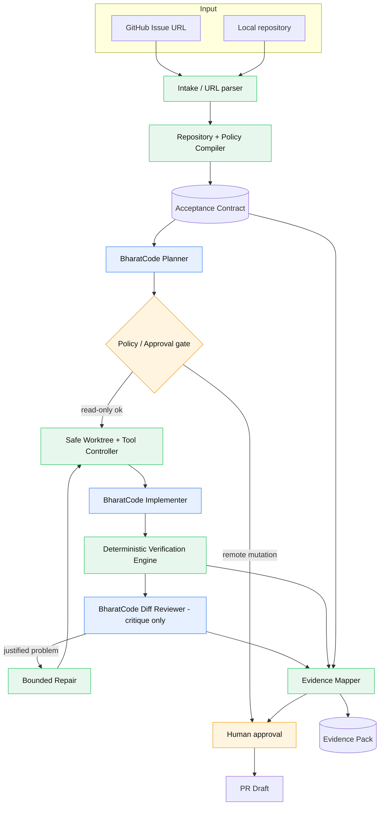
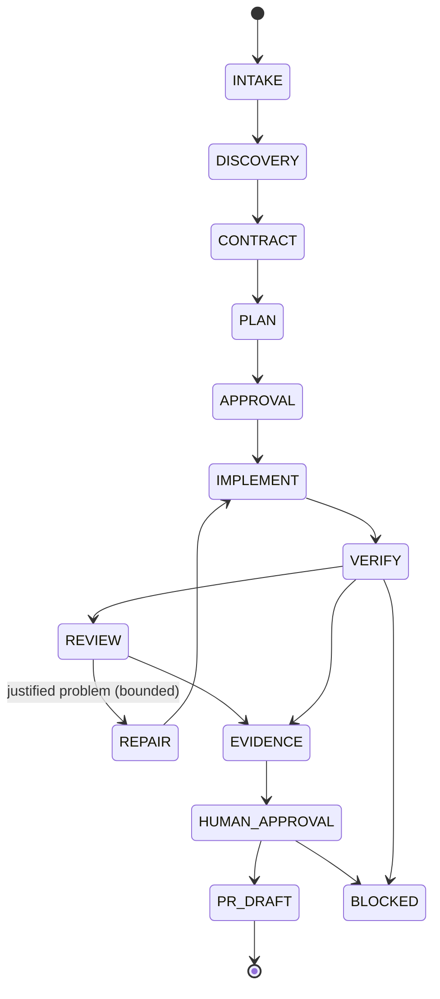

# MergeSutra — Architecture

Status: Stages 0-7 implement the components marked **[IMPLEMENTED]**; the rest
are **[DESIGNED]** / **[PLANNED]**. This document describes the whole intended
architecture so the built pieces fit it.

## 1. Trust model in one breath

> BharatCode decides and proposes.
> MergeSutra constrains and orchestrates.
> Repository tools execute.
> Deterministic gates verify.
> Evidence records what actually happened.
> Human decides whether to publish.

## 2. Component diagram



Blue = AI-powered (BharatCode). Green = deterministic. Orange = human.

## 3. AI / deterministic boundary

The model is used only where judgment genuinely helps (issue understanding,
planning, code generation, diff critique). Everything that can be decided
deterministically is **not** delegated to the model:

- **AI:** implementation plan; the choice of which of eight operations to ask for
  next, and the content of a proposed file; independent diff review. Each
  proposal is constrained by a schema and by a closed list of ids the contract
  already issued — including the criteria a model *suggests*, which stay
  labelled `MODEL CLAIM` inside the plan until a human states them.
- **Deterministic:** URL/repo parsing; policy compilation; criteria derivation;
  plan validation and provenance; worktree creation; **whether a proposed action
  runs at all** — path confinement, risk classification, budget accounting,
  no-progress detection; command execution and exit-code capture; verification
  gates; diff scope analysis; secret scanning; evidence mapping; final status
  computation.

Model output crosses the boundary only through Zod-validated schemas, and only
gets as much authority as the schema has a field for — which is why the plan
schema has no status, evidence or confidence field to fill in, and why the
implementation protocol has no field where a model could declare its own risk
class. The loop's shape is the clearest statement of the rule: BharatCode
proposes an action, deterministic code validates and authorises it, executes it
through the Stage 5 boundaries, and records what actually happened. A `FINISH`
answer is stored as `finishClaim`, because the model is the author of that
sentence and not the judge of it. The reviewer may critique but is never allowed
to silently edit code.

## 4. Trust boundaries

| Boundary      | Untrusted side                              | Enforced by                                        |
| ------------- | ------------------------------------------- | -------------------------------------------------- |
| Model output  | BharatCode text/JSON                        | A closed eight-action discriminated union with `.strict()` variants; Zod schemas; closed criterion-id list; argv-only commands; one bounded repair round; fail-safe |
| Repository    | File contents, CI/lint/test config, docs    | Policy compiler treats text as data, not authority; every sent file labelled untrusted in the prompt |
| Issue/comments| Body text, filenames, comments              | Authority hierarchy; prompt-injection defence      |
| Filesystem (write) | Any write target                       | `security/writer.ts`: relative paths only, every existing ancestor realpath'd and proved inside the workspace, no `.git` segment, no write through a link, byte cap, atomic |
| Filesystem (read)  | Any file a model names                 | `security/reader.ts`: same confinement, plus credential and binary rejection, per-file truncation, and a context budget that can run out |
| Process       | Commands to run                             | argv arrays, no `shell:true`, timeout, bounded output; `process/tool-policy.ts` derives the risk from the argv and refuses an interpreter handed a string; a program token with a space in it is refused before spawn |
| A repository's own gate | CI steps and declared scripts, discovered from an untrusted repository | `verify/consent.ts`: an entry runs only under an operator `--allow VG-00n` bound to this plan's digest, this command and this patch, so renaming a gate or editing the patch voids the yes; `verify/patch.ts`: a workspace sitting on another commit is refused; `verify/engine.ts`: the patch is re-described after every gate and a gate that moved it voids the verdict |
| Evidence      | A receipt, a model's claim, a stale workspace | `verify/evidence.ts`: one writer of a criterion's status, and it reads receipts only; a command that reaches no criterion's stated check proves nothing about it; a patch identity that no longer matches marks the rows `STALE`; `contributionReady` is a literal `false` in the schema, so no code path can set it |
| A second model's review | Findings about the patch, from a reviewer with no tools | `review/manifest.ts`: MergeSutra authors the only citable ids, and the reviewer is shown the page assembled for it rather than the repository; `review/disposition.ts`: an unanchored finding is `UNSUPPORTED`, a repeat is `DUPLICATE`, and the answer's schema has no field that could hold a verdict; `review/prompt.ts`: material whose line is shaped like a section heading is quoted behind a marker so it cannot open one; `review/stage.ts`: the patch identity is pinned before the question and re-measured after the answer, so bytes that moved in the meantime make the account `STALE` instead of authoritative |
| GitHub        | Any remote mutation                         | `tool-policy` approval gate: a remote action needs a human yes for that exact summary, and a destructive one has no yes that enables it. Stage 6 does not offer one: asking to push is a refusal, not a prompt |
| BharatCode    | Endpoint/credentials                        | Env-only config; central redaction; the key is required before a workspace is created |

## 5. Workflow state machine



Built today: `INTAKE → DISCOVERY → CONTRACT → PLAN → IMPLEMENT → VERIFY → REVIEW`,
one command each (`issue`, `inspect`, `contract`, `plan`, `implement`, `verify`,
`review`), each
writing a run record that the next one reads, and `report` rendering whatever the
chain has established into the pack a reviewer reads. `REVIEW` is a filing state,
not a driving one: it reads the patch Stage 7 measured, records findings and — when
one is routable — a repair plan frozen before any edit, and then returns the
workspace byte-identical. `REPAIR` onward is
**[DESIGNED]** — which is why a reviewed run points its `nextStage` at a loop that
no command starts yet, and why `mergesutra run`, `pr`,
`status` and `resume` still exit `2` as planned.

What Stage 7 added to this machine is a boundary rather than a box: `VERIFY` is
the only state that can move a criterion off `PENDING`, and it can do it only from
a receipt. An implementation run still never reaches `EVIDENCE` on its own — the
loop ends at a workspace full of uncommitted files, an action log and criteria
that are all still `PENDING`, and the operator has to ask for gates to run, by id,
against the patch that is really on disk.

Stage 5 built the two boxes the arrow to the left of `IMPL` depends on — the
worktree and the tool controller — as modules a stage calls, not as a command a
human runs. Stage 6 is the loop that calls them, and it changed the shape of
`IMPLEMENT` in one specific way: the box is entered through a closed list of
eight actions, so the arrow from `BH` back into `IMPL` in the diagram above is
not a model choosing a tool but a deterministic executor deciding whether the
action it was given may run at all.

`VERIFY` is entered the same way — through a closed set of names rather than a
willingness. The engine holds no gate list of its own: it takes the plan
discovered from the repository and executes the entries the operator named on the
command line, against the patch identity those names were minted for. A `FINISH`
claim arrives from the record and is filed as a claim, because the only writer of
a criterion's status is the mapper and the only thing it reads is a receipt.

`REVIEW` is entered the same way again, and the thing it closes off is the shape of
the answer. The reviewer is handed the exact patch Stage 7 measured plus a manifest
of citation ids MergeSutra authored itself, and the JSON it must return has no
status, score, grade or verdict field — there is nothing in it for a model to grant.
A finding that cannot be anchored on an id from that manifest is filed
`UNSUPPORTED` rather than deleted, and a surviving finding is given a *routing*
disposition, not a ruling on its merit. The only document with authority over a
later edit is the `RepairPlan`, and it is frozen before anything changes: Stage 9
holds no writer and runs no gate, and the workspace it reviewed comes back
byte-identical. A repair therefore re-enters `IMPLEMENT` and voids the old
documents as state, not as prose — the record a repair writes carries no review, and
Stage 7 must mint receipts against the new patch identity before any criterion row
means anything again.

Explicit bounded limits: agent steps, tool calls, repair attempts, repeated
identical failures, request/token budget, per-command runtime, and output size.
If progress stalls, the run **stops with evidence** rather than burning requests.

## 6. Layered modules

```
src/
  core/        AppError hierarchy, status enums,         [IMPLEMENTED]
               bounded argv-only process runner
  security/    central secret redaction, path             [IMPLEMENTED]
               confinement, injection signalling, shared
               command-shape rules, confined writer and
               confined reader (one root each)
  config/      env-only configuration loading            [IMPLEMENTED]
  bharatcode/  BharatCodeClient + HTTP adapter, schemas, [IMPLEMENTED]
               retry, timeouts, cancellation
  cli/         command surface, rendering, doctor,        [IMPLEMENTED]
               issue (intake only), inspect, contract,
               plan, implement, verify, exit codes
  intake/      issue URL parsing, local-repo reading,     [IMPLEMENTED]
               intake orchestrator
  github/      gh-CLI source + Zod-validated payloads     [IMPLEMENTED]
  state/       versioned run record + atomic file store   [IMPLEMENTED]
  discovery/   confined repo reader, manifest/CI          [IMPLEMENTED]
               discovery, repository contract
  contract/    Acceptance Contract schema + criteria      [IMPLEMENTED]
               derivation, revision-with-reason
  plan/        plan schema (no status field), prompt      [IMPLEMENTED]
               shaping, coverage checks, planner against
               BharatCodeClient — holds no process runner
  implement/   the bounded loop: closed action protocol,  [IMPLEMENTED]
               context assembler, prompt shaping, twelve
               enforced limits, no-progress identity,
               implementation record (no status field a
               criterion could be marked PASS in)
  git/         worktree at the pinned base SHA,           [IMPLEMENTED]
               ignore pre-flight, dirty-state report,
               idempotent reuse, never a cleanup
  process/     risk-classified tool controller — the       [IMPLEMENTED]
               class comes from the argv, not the caller;
               approval gate, destructive refusal
  verify/      the deterministic engine: gate discovery   [IMPLEMENTED]
               with provenance, patch identity, execution
               consent bound to a plan digest, receipts,
               per-gate contamination re-check, and
               conservative criterion evidence mapping
  review/      independent diff reviewer wiring: a      [IMPLEMENTED]
               context assembled from the record and the
               bytes, a manifest of citation ids MergeSutra
               authored, one question with no verdict field,
               findings weighed against that manifest,
               dispositions, a RepairPlan frozen before any
               edit, and the workspace left byte-identical
  report/      the evidence pack: record in, the three    [IMPLEMENTED]
               reviewer files out, copied status for
               status, receipts re-emitted verbatim,
               caveats grouped by the document that wrote
               them, written atomically beside the record
```

The loop's dependencies are the whole point of that layout: `implement/` is the
only module that both holds a `BharatCodeClient` and reaches the filesystem, and
it reaches nothing directly. It imports the Stage 5 writer, the Stage 5 reader,
the Stage 5 tool policy, the bounded runner and `git/workspace.ts` — so the
answer to "could a stage after this one bypass the boundaries?" is that there is
no bypass to take, only the same five modules.

## 7. Adapter rule (already implemented)

The rest of the application depends only on the `BharatCodeClient` interface —
`listModels`, `complete`, `completeStructured`, `healthCheck` — never on HTTP
details. `fetch`, the sleeper, and the randomness source are injected so the
entire adapter is offline-testable. This keeps MergeSutra free of any hardcoded
provider assumption while still defaulting to BharatCode's documented
OpenAI-compatible API at `https://bharatcode.ai/api/model/v1`.

`mergesutra plan` is the first consumer, and it uses `complete` only: one
unstructured request whose answer must parse and validate, because
`completeStructured` would let the adapter's own JSON instruction shape the
prompt the planner is trying to control. The planner receives a
`BharatCodeClient`, not a fetch, a key, or a URL — so a test can hand it an
answer and assert what the stage did with it, and the stage cannot reach the
network except through the adapter.

`implement` and `review` are the second and third consumers, and both keep the
same rule for the same reason: each asks for one `complete` per turn and validates
the text locally, so the schema the stage enforces is the stage's own and not
something the transport negotiated on its behalf. `requestReview` calls nothing
else on the client — no `completeStructured`, no `listModels`, no `healthCheck` —
and the hero reviewer's test double makes that observable by refusing all three if
asked. The `modelId` that lands in the record is the one the endpoint answered
with, never the one a page advertises, so swapping today's model for tomorrow's
changes a config value and every recorded id, not a line of prompt code.

## 8. Evidence pack layout **[PARTLY SHIPPED]**

```
.mergesutra/runs/<run-id>/
  <run-id>.json       the run record every stage writes — SHIPPED, and it is the
                      only file a stage other than `report` writes here
  report.md           human-readable report          — SHIPPED
  report.json         machine-readable report        — SHIPPED
  commands.jsonl      one receipt per executed gate  — SHIPPED
  manifest.json       run identity: repo, branch, base SHA, model, timing
  contract.json       versioned Acceptance Contract with revisions
  plan.json           implementation plan
  verification.json   gate results with sources
  review.json         reviewer findings
```

The three shipped files are a rendering of `<run-id>.json` and nothing else.
`report.json` embeds the record's `evidence`, `verificationPlan` and
`executionConsent` documents as they were filed, `commands.jsonl` re-emits each
receipt from `record.verification` line for line, and `report.md`'s criteria table
copies each row's status, sufficiency and gate ids. So splitting the same content
into one file per stage — the still-designed names above — would add a second
place for a fact to live and a second chance for the two to disagree. Stage 9
proved that reasoning rather than working around it: a review and a repair plan are
now documents in the record, and the pack renders them into `report.md` and
`report.json` from that same record, so `review.json` stays a name with no file
behind it and no second copy of a finding to fall out of step with the first.
What is left for later stages is the content those files would hold that no stage
has established yet — a run-level `manifest.json`, if a later stage ever needs
identity that the record does not already carry.

Nothing here is committed automatically, and no pack contains a secret: output is
redacted on the way into the receipt, and the receipts are what the pack copies.
The record is schema version 7 — Stage 9 added `review` and `repairPlan` to it and
kept every v6 document readable and interpretable on its own terms; a v6 record
gains no findings it never had — and a file written by an earlier stage build is
reported as unreadable rather than guessed at, so `report` refuses it instead of
rendering an empty pack around the refusal.
