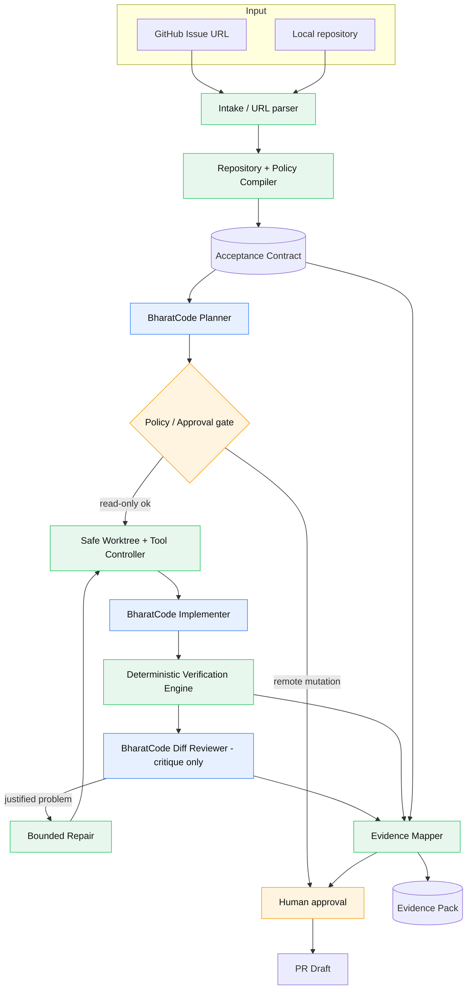
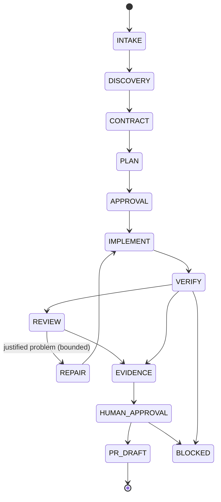

# MergeSutra — Architecture

Status: Stage 0 implements the shaded components marked **[IMPLEMENTED]**; the
rest are **[DESIGNED]** / **[PLANNED]**. This document describes the whole
intended architecture so the built pieces fit it.

## 1. Trust model in one breath

> BharatCode decides and proposes.
> MergeSutra constrains and orchestrates.
> Repository tools execute.
> Deterministic gates verify.
> Evidence records what actually happened.
> Human decides whether to publish.

## 2. Component diagram



Blue = AI-powered (BharatCode). Green = deterministic. Orange = human.

## 3. AI / deterministic boundary

The model is used only where judgment genuinely helps (issue understanding,
planning, code generation, diff critique). Everything that can be decided
deterministically is **not** delegated to the model:

- **AI:** issue analysis → candidate criteria; implementation plan; code
  generation; independent diff review.
- **Deterministic:** URL/repo parsing; policy compilation; worktree creation;
  command execution and exit-code capture; verification gates; diff scope
  analysis; secret scanning; evidence mapping; final status computation.

Model output crosses the boundary only through Zod-validated schemas. The
reviewer may critique but is never allowed to silently edit code.

## 4. Trust boundaries

| Boundary      | Untrusted side                              | Enforced by                                        |
| ------------- | ------------------------------------------- | -------------------------------------------------- |
| Model output  | BharatCode text/JSON                        | Zod schemas; controlled repair; fail-safe          |
| Repository    | File contents, CI/lint/test config, docs    | Policy compiler treats text as data, not authority |
| Issue/comments| Body text, filenames, comments              | Authority hierarchy; prompt-injection defence      |
| Filesystem    | Any write target                            | Path must resolve inside authorized workspace      |
| Process       | Commands to run                             | argv arrays, no `shell:true`, timeout, bounded out |
| GitHub        | Any remote mutation                         | Explicit human approval gate                       |
| BharatCode    | Endpoint/credentials                        | Env-only config; central redaction                 |

## 5. Workflow state machine



Explicit bounded limits: agent steps, tool calls, repair attempts, repeated
identical failures, request/token budget, per-command runtime, and output size.
If progress stalls, the run **stops with evidence** rather than burning requests.

## 6. Layered modules

```
src/
  core/        AppError hierarchy, status enums,         [IMPLEMENTED]
               bounded argv-only process runner
  security/    central secret redaction, path             [IMPLEMENTED]
               confinement, injection signalling
  config/      env-only configuration loading            [IMPLEMENTED]
  bharatcode/  BharatCodeClient + HTTP adapter, schemas, [IMPLEMENTED]
               retry, timeouts, cancellation
  cli/         command surface, rendering, doctor,        [IMPLEMENTED]
               issue (intake only), exit codes
  intake/      issue URL parsing, local-repo reading,     [IMPLEMENTED]
               intake orchestrator
  github/      gh-CLI source + Zod-validated payloads     [IMPLEMENTED]
  state/       versioned run record + atomic file store   [IMPLEMENTED]
  contract/    Acceptance Contract engine                [DESIGNED]
  git/         worktree / base SHA / safe workspace      [PLANNED]
  process/     risk-classified tool controller           [PLANNED]
  discovery/   repository policy compiler                [PLANNED]
  verification/deterministic verification engine         [PLANNED]
  review/      independent diff reviewer wiring          [PLANNED]
  evidence/    evidence pack + report renderer           [PLANNED]
```

## 7. Adapter rule (already implemented)

The rest of the application depends only on the `BharatCodeClient` interface —
`listModels`, `complete`, `completeStructured`, `healthCheck` — never on HTTP
details. `fetch`, the sleeper, and the randomness source are injected so the
entire adapter is offline-testable. This keeps MergeSutra free of any hardcoded
provider assumption while still defaulting to BharatCode's documented
OpenAI-compatible API at `https://bharatcode.ai/api/model/v1`.

## 8. Evidence pack layout **[DESIGNED]**

```
.mergesutra/runs/<run-id>/
  manifest.json       run identity: repo, branch, base SHA, model, timing
  contract.json       versioned Acceptance Contract with revisions
  plan.json           implementation plan
  commands.jsonl      bounded, redacted command receipts (argv, cwd, exit, time)
  verification.json   gate results with sources
  review.json         reviewer findings
  report.md           human-readable report
  report.json         machine-readable report
```

Never committed automatically; never contains secrets.
